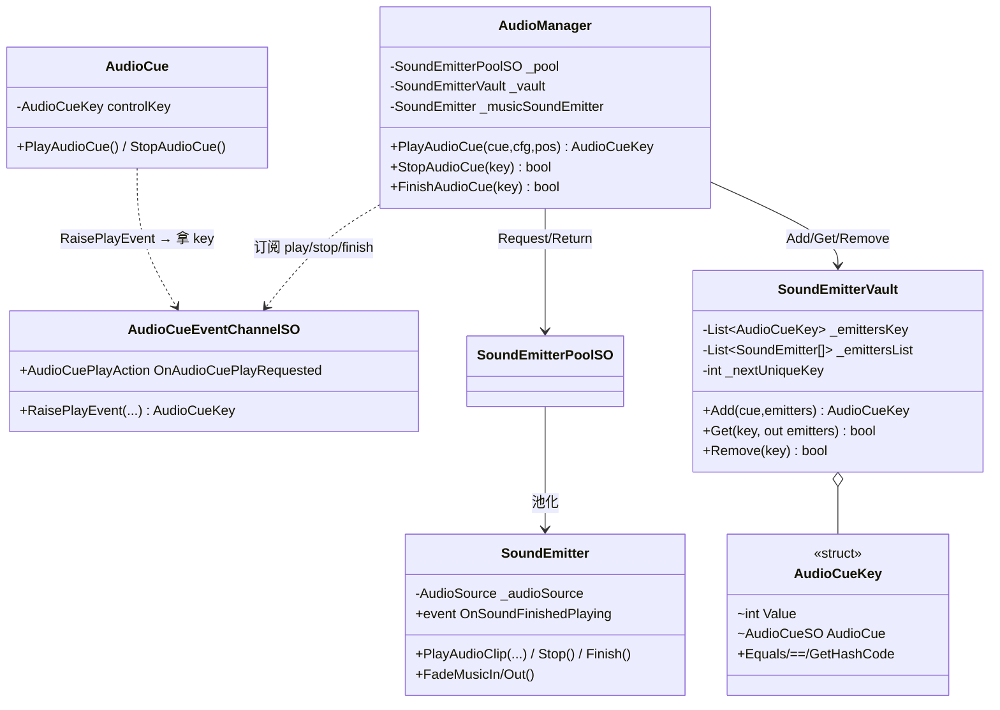
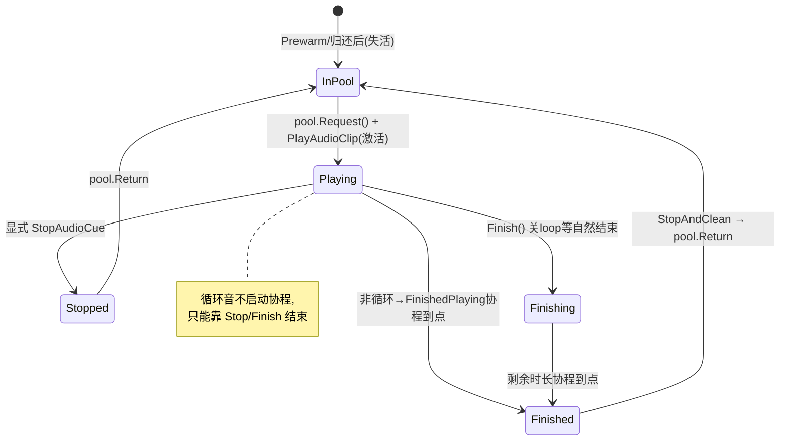
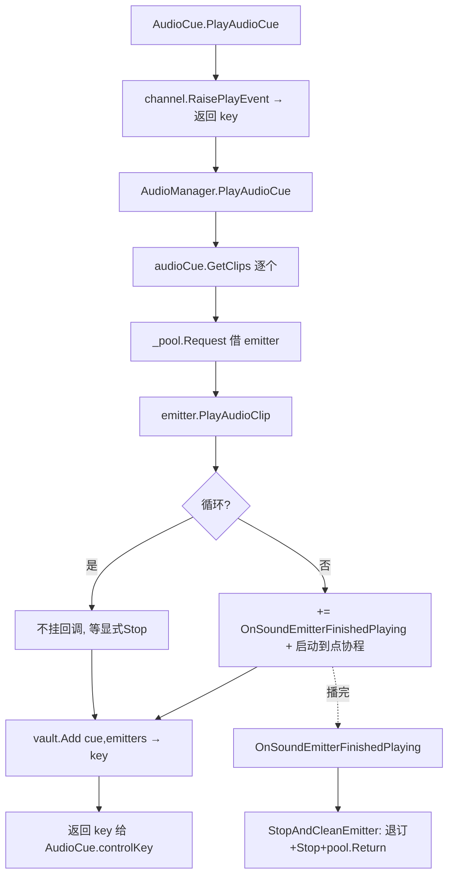

# Audio 模块解析

> 坐标：**组合应用层 · 优先级 5**。是「核心底座的集大成消费者」——同时用到 `Pool`(SoundEmitter 复用)、`Factory`(SoundEmitterFactorySO)、`Events`(AudioCueEventChannelSO 带返回值通道)。
> 源码位置：`Assets/Scripts/Audio/{., SoundEmitters, AudioData}`。

---

## 一、契约定义

### 核心类清单

| 文件 | 角色 | 可见性 |
|---|---|---|
| `AudioManager.cs` | 中枢：监听 cue 通道、借还 emitter、管混音器音量 | `public class : MonoBehaviour` |
| `SoundEmitters/SoundEmitter.cs` | 单个发声体（包 AudioSource，含 DOTween 淡入淡出）| `public class : MonoBehaviour` |
| `SoundEmitters/SoundEmitterPoolSO.cs` | SoundEmitter 池（继承 ComponentPoolSO）| `: ComponentPoolSO<SoundEmitter>` |
| `SoundEmitters/SoundEmitterFactorySO.cs` | 工厂：`Instantiate(prefab)` | `: FactorySO<SoundEmitter>` |
| `SoundEmitters/SoundEmitterVault.cs` | **金库**：AudioCueKey ↔ SoundEmitter[] 双列表映射 | `public class`（普通类，非 SO）|
| `AudioData/AudioCueKey.cs` | 不可变 struct 句柄（int 序号 + cue 引用 + 自定义相等）| `public struct` |
| `AudioData/AudioCueSO.cs` | 声音定义：多个 `AudioClipsGroup`（含随机/顺序播放）| `: ScriptableObject` |
| `AudioData/AudioConfigurationSO.cs` | 播放参数（音量/空间化等，`ApplyTo(AudioSource)`）| `: ScriptableObject`（未逐行精读，按 `ApplyTo` 调用点推断）|
| `AudioCue.cs` | 场景物体上的「请求播放」组件 | `public class : MonoBehaviour` |

### 穿透语法的关键设计约束（基于源码）

1. **AudioManager 不持有声音逻辑，只做「请求 → 借 emitter → 播 → 登记句柄 → 回收」的编排。** 它在 `OnEnable` 把自己的方法挂到 `AudioCueEventChannelSO` 的三个委托（play/stop/finish）上，`PlayAudioCue` 返回 `AudioCueKey`——这正是 Events 模块「带返回值请求通道」的落地。
2. **一次 AudioCue 可能对应多个 SoundEmitter（并行多 clip）。** `PlayAudioCue` 对 `audioCue.GetClips()` 数组逐个 `_pool.Request()`，得到 `SoundEmitter[]`，整组用一个 `AudioCueKey` 登记到金库——句柄的粒度是「一次播放请求」而非「单个 AudioSource」。
3. **`SoundEmitterVault` 是「并行数组」式注册表，不是 Dictionary。** 用 `List<AudioCueKey> _emittersKey` + `List<SoundEmitter[]> _emittersList` 两条等长列表，靠 `FindIndex` 线性查找配对。这是有意的简单实现（声音并发量小），代价是查找 O(n)。
4. **`AudioCueKey` 是值类型句柄，自增序号 + cue 引用共同构成身份，并重写了相等/哈希。** `_nextUniqueKey++` 保证每次播放唯一；`Equals`/`==` 比较 `Value && AudioCue`。`Invalid = (-1, null)` 是哨兵。调用方（`AudioCue.cs`）持有 key 后才能 Stop/Finish。
5. **借还的「归还时机」分散在多条回调路径**：非循环音播完 → `SoundEmitter.OnSoundFinishedPlaying` 协程触发 → `OnSoundEmitterFinishedPlaying` → `StopAndCleanEmitter` 归还池；显式 `StopAudioCue` → 遍历归还 + 从金库移除；`Finish` → 把 loop 关掉让其自然播完再走 finished 路径。
6. **音乐是单例 emitter，走独立的淡入淡出路径。** `_musicSoundEmitter` 单字段；`PlayMusicTrack` 若已在播且是不同曲子则 `FadeMusicOut`（拿到淡出起始时间）再 `FadeMusicIn` 新曲（用 DOTween `DOFade`）。音乐返回 `AudioCueKey.Invalid`（不需句柄管理）。
7. **`AudioClipsGroup.GetNextClip` 内含三种序列模式的状态机**：`Random`/`RandomNoImmediateRepeat`（do-while 避免连续重复）/`Sequential`（`Mathf.Repeat` 循环）。`_nextClipToPlay`/`_lastClipPlayed` 是该 group 的可变播放游标。

### 类图

---

## 二、生命周期与内存

### 动词语义表

| 操作 | 做什么 | 内存/资源语义 |
|---|---|---|
| `AudioManager.Awake` | new Vault；`_pool.Prewarm` + `SetParent` | 预创建 N 个 SoundEmitter（失活挂池根）|
| `PlayAudioCue` | 逐 clip `_pool.Request()`，播放，登记金库 | **借出** emitter（零分配命中）；金库两列表各 Add 一项；返回新 key |
| `RaisePlayEvent` → 返回 key | 经事件通道 RPC 拿句柄 | key 是值类型，无堆分配 |
| `SoundEmitter.PlayAudioClip` | 配置 AudioSource 并 Play；非循环启动 `FinishedPlaying` 协程 | 启动一个协程（WaitForSeconds clip.length）|
| `OnSoundFinishedPlaying`（事件）| 协程到点 `NotifyBeingDone` 触发 | 委托回调 |
| `StopAndCleanEmitter` | 退订（非循环）、`Stop`、`_pool.Return` | **归还**到池（失活挂回根）|
| `StopAudioCue(key)` | 金库 `Get` → 逐个停并归还 → 金库 `Remove(key)` | 归还 + 金库两列表各 RemoveAt |
| `FinishAudioCue(key)` | 把循环关掉让自然播完 | 不立即归还（延后到 finished 回调）|
| `PlayMusicTrack` | 淡出旧 + 借新 emitter 淡入 | 借一个 emitter；DOTween 补间 |

### 状态机（单个 SoundEmitter 在一次 SFX 播放中的流转）

### 关键流程：一次 SFX 的请求-播放-回收闭环

---

## 三、跨层桥接

- **底座组合**：Audio 是「Pool + Factory + Events」三底座的交汇点。SoundEmitter 的生命周期由 Pool 管（借还）、创建由 Factory 管（Instantiate prefab）、播放请求由 Events 的带返回值通道传递。
- **注入点**：`AudioCueEventChannelSO` 三委托是接缝——任意场景物体经 `AudioCue.cs` 的 `RaisePlayEvent` 请求播放，`AudioManager` 应答并回传 `AudioCueKey`。请求方与播放方零编译耦合。
- **跨层 DTO/快照**：`AudioCueKey`（不可变 struct）是「播放会话句柄」，从 AudioManager 经事件通道返回到请求方，请求方据此后续 Stop/Finish。`AudioCueSO`/`AudioConfigurationSO` 是只读配置 DTO（`GetClips()` / `ApplyTo()`）。
- **金库的角色**：`SoundEmitterVault` 把「一次播放请求（key）」与「实际占用的 emitter 数组」解耦登记，使 AudioManager 能凭 key 反查并批量停止/回收——它是连接「外部句柄」与「内部池化资源」的间接层。
- **与 SceneManagement 协作**：`GameSceneSO.musicTrack` 携带场景音乐；场景切换后播放音乐走同一套 cue 通道（未在本仓库逐行追踪具体 MusicPlayer 触发点，但 `PlayMusicTrack` 路径已读）。

---

## 四、落地难点（脱离框架仿写时最有价值的 3 点）

1. **「句柄 ↔ 池化资源」的双向登记与回收一致性最难。** 金库登记 key→emitters，但回收路径有多条（自然播完、显式 Stop、Finish）。源码注释自己都标了 TODO：`StopAndCleanEmitter` 在 finished 回调后归还了 emitter，却**没有从金库 Remove 对应 key**——即「自然播完」路径会留下金库里的悬空 key（指向已归还/复用的 emitter）。仿写时必须让「归还 emitter」与「金库移除 key」严格配对，否则 key 悬空 → 后续凭旧 key Stop 会误操作已被复用的 emitter。

2. **循环音与非循环音的回收路径不对称，是隐形分叉。** 非循环音启动 `FinishedPlaying` 协程自动走回收；循环音**不启动协程**，只能靠外部 `Stop`/`Finish`。漏调 Stop 的循环音会永久占用一个 emitter（池被慢慢掏空）。仿写时要显式区分两种生命周期，并保证循环音有明确的结束触发者。

3. **音乐的「淡出旧 + 淡入新」时序与单例约束。** `_musicSoundEmitter` 是单字段，切歌时先 `FadeMusicOut`（返回当前播放时间用于新曲对齐）再 `FadeMusicIn`。淡出用 DOTween 补间且在 `onComplete` 触发归还。脱离 DOTween 需自己写音量插值 + 完成回调，并处理「淡出未完成时又来切歌」的竞态——原版用「相同曲子直接返回 Invalid」规避重复播放，但快速连切仍可能让旧 emitter 未归还就被覆盖。
