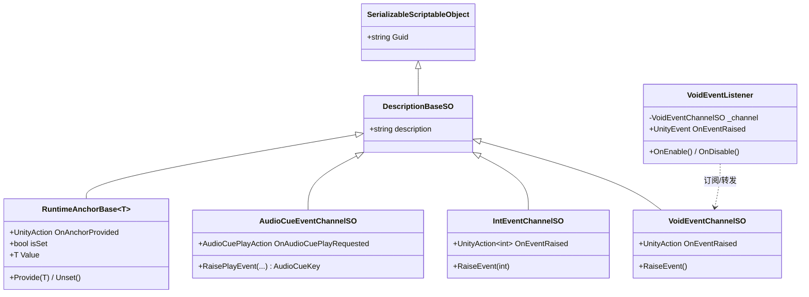
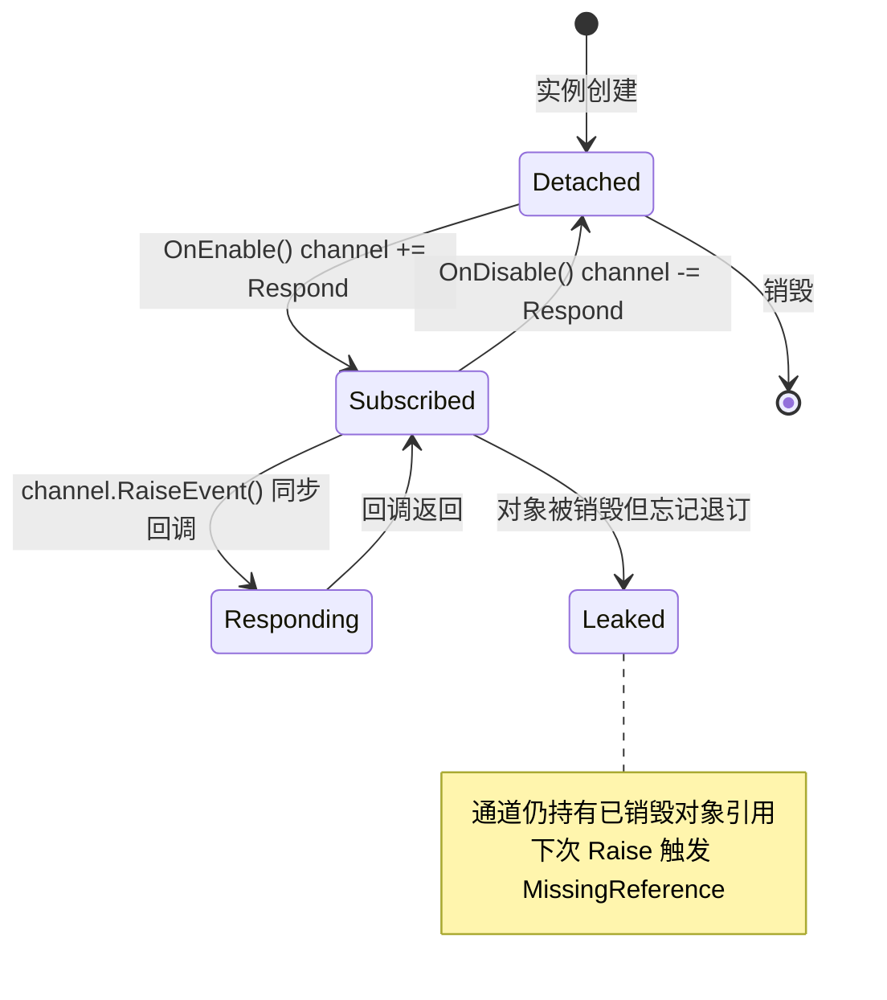
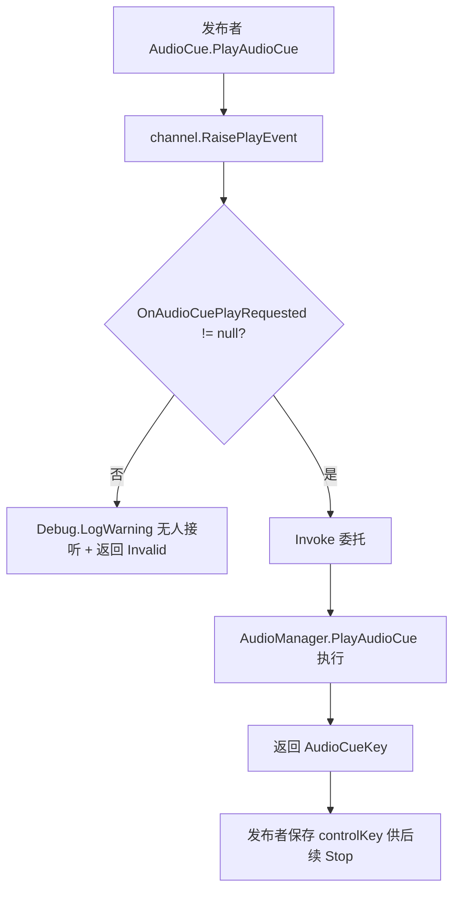

# Events 模块解析（含 RuntimeAnchors）

> 坐标：**核心底座 · 优先级 2**。依赖 `BaseClasses/DescriptionBaseSO`。被几乎所有上层模块依赖（Audio、SceneManagement、SaveSystem、UI、Characters…）。
> 源码位置：`Assets/Scripts/Events/`、`Assets/Scripts/RuntimeAnchors/`。

---

## 一、契约定义

### 核心类清单（节选 24 文件中的代表）

| 文件 | 角色 | 可见性 |
|---|---|---|
| `ScriptableObjects/VoidEventChannelSO.cs` | 无参事件通道 | `public class : DescriptionBaseSO` |
| `ScriptableObjects/IntEventChannelSO.cs` | 单 int 参事件通道 | 同上 |
| `ScriptableObjects/LoadEventChannelSO.cs` | 三参（场景/loading/fade）通道 + 无人接听告警 | 同上 |
| `ScriptableObjects/AudioCueEventChannelSO.cs` | **带返回值**的事件通道（play 返回 `AudioCueKey`）| 同上 |
| `VoidEventListener.cs` | 把通道桥接到 Inspector 的 `UnityEvent` | `public class : MonoBehaviour` |
| `IntEventListener.cs` | 同上（带 int 载荷 + 自定义 `IntEvent : UnityEvent<int>`）| 同上 |
| `RuntimeAnchors/RuntimeAnchorBase.cs` | 运行时引用锚点（带 `OnAnchorProvided`）| `public class RuntimeAnchorBase<T> : DescriptionBaseSO where T:Object` |
| `RuntimeAnchors/TransformAnchor.cs` | `Transform` 锚点实例 | `public class : RuntimeAnchorBase<Transform>` |

### 穿透语法的关键设计约束（基于源码）

1. **事件通道是 ScriptableObject 资产，不是代码里的 `static event`。** `VoidEventChannelSO : DescriptionBaseSO : SerializableScriptableObject : ScriptableObject`。发布者和订阅者都在 Inspector 里拖入**同一份通道资产**——双方在编译期互不知晓，仅通过资产引用解耦。这是整个项目的解耦中枢。
2. **通道只持有一个 `UnityAction` 委托字段，而非 C# `event`。** 如 `public UnityAction OnEventRaised;`——是**公开字段**不是 `event`，意味着外部理论上能直接 `OnEventRaised = null` 清空（设计权衡：换取简单与 Inspector 友好）。
3. **`RaiseEvent` 永远先判空再 Invoke。** `if (OnEventRaised != null) OnEventRaised.Invoke();`——没有订阅者时静默（部分通道如 `LoadEventChannelSO` 改为「无人接听时打印告警」，因为漏接场景加载是严重错误）。
4. **带返回值的通道是特例。** `AudioCueEventChannelSO.RaisePlayEvent` 返回 `AudioCueKey`——用自定义 `delegate AudioCueKey AudioCuePlayAction(...)` 而非 `UnityAction`，因为 `UnityAction` 无返回值。返回值让「事件」退化为「请求-应答」（RPC 风格），调用方拿 key 后续可 Stop/Finish。
5. **Listener 是「通道 → UnityEvent」的适配器。** `VoidEventListener` 在 `OnEnable` 订阅、`OnDisable` 退订，收到回调后转发给 Inspector 上可视化连线的 `UnityEvent OnEventRaised`。即：通道负责跨场景广播，Listener 负责把广播落到本场景某个 GameObject 的具体响应。
6. **RuntimeAnchor 是「带通知的全局引用槽」。** `Provide(value)` 写入 `_value`、置 `isSet`、触发 `OnAnchorProvided`；`Unset` 清空。它解决「A 场景的对象要引用 B 场景运行时才存在的对象（如玩家 Transform）」——通过共享锚点 SO 资产间接持有。

### 类图

---

## 二、生命周期与内存

### 动词语义表

| 操作 | 做什么 | 内存语义 |
|---|---|---|
| `RaiseEvent(...)` | 判空后 `Invoke` 委托链 | 无分配（除非有装箱/闭包）；**同步**调用所有订阅者 |
| `OnEventRaised +=`（订阅）| 把方法加入多播委托 | 委托链节点分配；**不退订即泄漏引用** |
| `OnEventRaised -=`（退订）| 从委托链移除 | 释放该引用 |
| `Listener.OnEnable` | 订阅通道 | 建立 通道→Listener 的强引用 |
| `Listener.OnDisable` | 退订通道 | 断开引用（关键：防止失活对象仍被回调）|
| `Anchor.Provide(v)` | 写值 + 置位 + 触发 `OnAnchorProvided` | 仅引用赋值；通知所有等待者 |
| `Anchor.Unset` / `OnDisable` | 清空引用 + 复位 | 断开对 `_value` 的持有 |

### 状态机（Listener 订阅生命周期）

### 关键流程：一次跨场景事件广播

---

## 三、跨层桥接

- **解耦中枢**：通道 SO 是发布者与订阅者之间唯一的共享物。`SceneLoader` 在字段上用 `[Header("Listening to")]` / `[Header("Broadcasting on")]` 显式标注它监听哪些、广播哪些通道——这是项目约定的「数据流自文档化」。
- **注入点**：每个 `*EventChannelSO` 都是一个回调注入接缝。上层把自己的方法 `+=` 到通道，下层只管 `RaiseEvent`，双方零编译期耦合。
- **跨层 DTO**：载荷即委托参数。无参（Void）、值类型（int/float/bool）、复杂类型（`GameSceneSO`、`AudioCueSO`）、甚至**带返回值**（`AudioCueKey`）。`AudioCueKey` 是不可变 struct 快照（见 Audio 模块），作为「请求句柄」回传。
- **RuntimeAnchor 跨层**：`Characters`/`Camera` 等通过共享 `TransformAnchor` 资产间接拿到运行时才生成的玩家 Transform——发布者 `Provide`，消费者订阅 `OnAnchorProvided` 或轮询 `isSet`。

---

## 四、落地难点（脱离框架仿写时最有价值的 3 点）

1. **「资产即事件总线」无法在纯代码直接复刻。** SO 的价值在于：发布订阅双方都在 Inspector 拖同一份资产，编译期零耦合且美术/策划可配置。纯 C# 仿写要么用「字符串/枚举 key 索引的全局 EventBus 字典」，要么用 DI 注入同一个 channel 实例——两者都会重新引入「key 命名管理」或「容器生命周期」问题，这正是 SO 方案优雅之处。

2. **订阅/退订的对称性是隐形不变量。** 源码严格 `OnEnable +=` / `OnDisable -=`。漏退订 → 通道持有已销毁 MonoBehaviour 引用 → 下次 `RaiseEvent` 抛 `MissingReferenceException` 或回调到「僵尸对象」。仿写时若用普通 `event`，必须保证生命周期成对管理，否则内存泄漏 + 悬空回调。

3. **「字段委托」vs「C# event」的取舍后果。** 原版用 public `UnityAction` 字段（非 `event`），换来 Inspector 可见与简单，但牺牲了封装：任何持有通道引用者都能 `channel.OnEventRaised = null` 抹掉所有订阅，或越权 `Invoke`。健壮仿写要在「封装安全（用 `event` + Raise 方法）」与「灵活性」间权衡——原版有意选了灵活。
