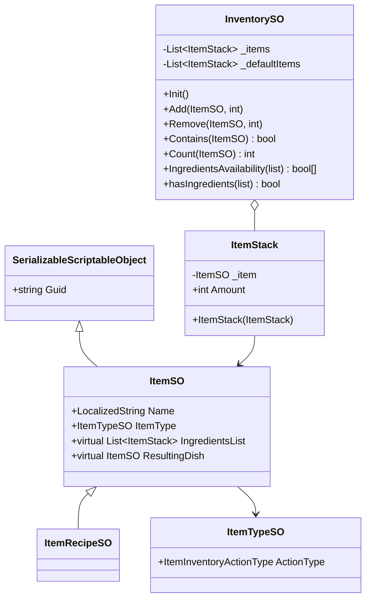
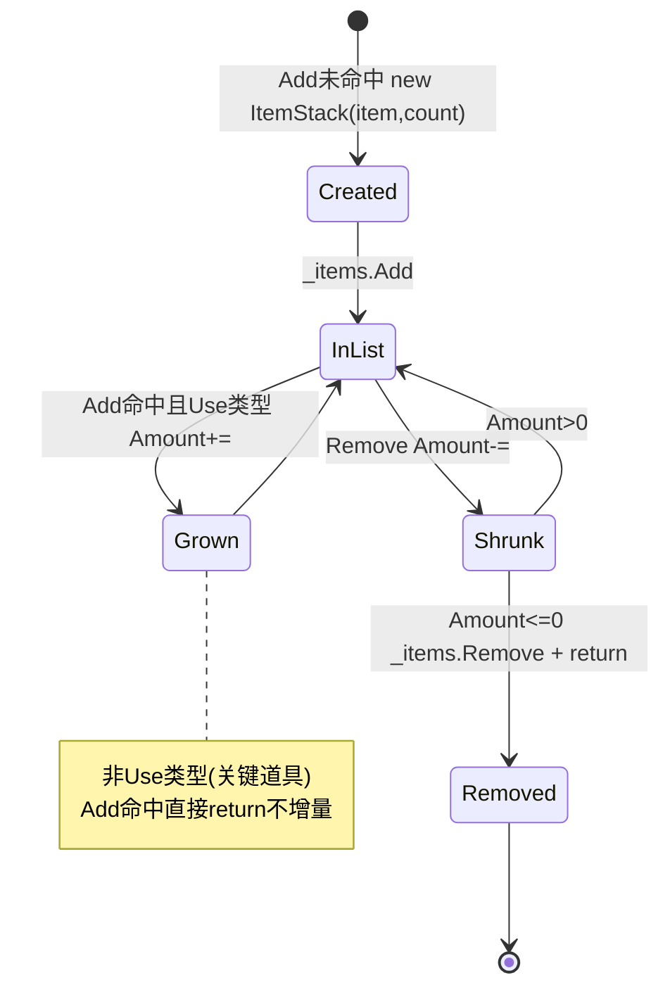
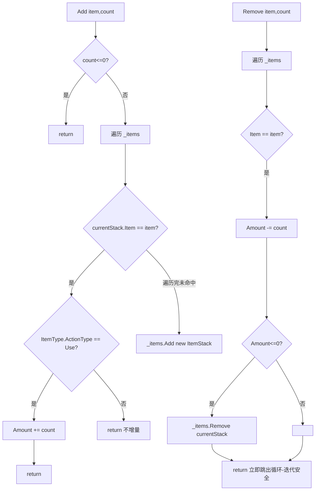

# Inventory 模块解析

> 坐标：**业务承载层 · 优先级 7**。依赖 `BaseClasses`(SerializableScriptableObject)、`Events`(ItemEventChannelSO 等)、`Localization`。被 `SaveSystem`、`Quests`、`UI`、`Cooking` 协作消费。
> 源码位置：`Assets/Scripts/Inventory/{., ScriptableObjects}`。本文聚焦数据核心 `InventorySO`/`ItemStack`/`ItemSO`，UI/Picker 等表现层在跨层处提及。

---

## 一、契约定义

### 核心类清单

| 文件 | 角色 | 可见性 |
|---|---|---|
| `ScriptableObjects/InventorySO.cs` | 背包数据核心：增删查 + 配方可用性判断 | `: ScriptableObject` |
| `ItemStack.cs` | 物品栈（ItemSO 引用 + 数量），`[Serializable]` | `public class` |
| `ScriptableObjects/ItemSO.cs` | 物品定义（名/图/描述/类型/预制体），含 GUID | `: SerializableScriptableObject` |
| `ScriptableObjects/ItemTypeSO.cs` | 物品类型（含 `ItemInventoryActionType`：Use/Cook/...）| `: ScriptableObject`（按引用推断）|
| `ScriptableObjects/ItemRecipeSO.cs` | 配方（原料列表 → 成品）| `: ItemSO`（按 IngredientsList/ResultingDish 推断）|
| `InventoryManager.cs` / `ItemPicker.cs` | 表现/交互层（拾取、UI 联动）| `MonoBehaviour`（未逐行精读）|

### 穿透语法的关键设计约束（基于源码）

1. **背包是 ScriptableObject 资产，状态存于 SO 上的 `List<ItemStack>`。** 与 Pool/Events 同构——`InventorySO` 作为可被多系统引用的共享背包数据。`_items` 是运行时实际背包，`_defaultItems` 是新游戏初始内容（`Init()` 用 `new ItemStack(item)` **深拷贝**默认项填充，避免直接引用默认列表被运行时修改污染）。
2. **`Add` 的合并规则取决于物品类型。** 遍历找到同 `ItemSO` 的栈后，**只有 `ItemType.ActionType == Use` 才累加数量**；否则（如任务道具）即使已存在也直接 return 不增量——即「可消耗品可堆叠，关键道具不堆叠」。找不到则新建一个 `ItemStack(item, count)`。
3. **`Remove` 在数量归零时从列表移除该栈。** 减量后 `if (Amount <= 0) _items.Remove(currentItemStack)`。注意它在 `for` 循环内对正在遍历的 `_items` 调用 `Remove` 后立即 `return`——**靠 return 跳出循环**规避了「遍历中修改集合」的迭代器失效问题（这是关键的迭代安全技巧）。
4. **`ItemStack` 是引用类型（class）且 `Amount` 是公开可变字段。** `Add`/`Remove` 直接改 `currentItemStack.Amount`——因为是 class，列表里取出的是同一引用，改 Amount 即改背包内容。`Item` 则是只读（`_item` 私有 + 只读属性），栈一旦建立物品不可换。
5. **配方可用性有两套查询**：`IngredientsAvailability` 返回**每个原料是否齐备的 bool 数组**（供 UI 逐项显示缺哪个）；`hasIngredients` 返回**整体能否合成的单 bool**（用嵌套 `Exists` 双否定：「不存在任一缺料」）。两者都用 `List.Exists` 做线性匹配。
6. **`ItemSO` 用 `virtual` 属性预留派生扩展点。** `IngredientsList`/`ResultingDish`/`IsLocalized`/`LocalizePreviewImage` 都是 `virtual`，基类返回默认，由 `ItemRecipeSO`/`LocalizedItemSO` 等子类 override——「组合派生」母题：基础物品与配方/本地化物品共享同一接口。

### 类图

---

## 二、生命周期与内存

### 动词语义表

| 操作 | 做什么 | 内存语义 |
|---|---|---|
| `Init()` | 清空 `_items`，逐个 `new ItemStack(默认项)` 深拷贝填充 | **分配**：每个默认项新建 ItemStack（防污染默认列表）|
| `Add(item, n)` | 找同物品栈：Use 类型累加 Amount，否则不变；找不到则新建栈 | 命中改字段（无分配）；未命中 `new ItemStack` + `List.Add`（可能扩容）|
| `Remove(item, n)` | 找栈减 Amount；归零则 `_items.Remove` + return | 命中改字段；归零移除栈引用 |
| `Contains/Count` | 线性遍历匹配 ItemSO 引用 | 无分配，O(n) |
| `IngredientsAvailability` | `new bool[n]` + 逐原料 `_items.Exists` 匹配 | **分配**一个 bool 数组 |
| `hasIngredients` | 嵌套 `Exists` 双否定，返回单 bool | 无分配（闭包可能装箱，忽略）|

### 状态机（一个 ItemStack 在背包中的生命）

### 关键流程：Add 的类型分支 + Remove 的迭代安全移除

---

## 三、跨层桥接

- **共享数据核心**：`InventorySO` 是「单一真相源」式背包数据，被 SaveSystem（存读）、Quests（检查是否拥有任务物品）、UI（显示）、Cooking（合成）共同引用同一资产。所有改动经 `Add`/`Remove`，读经 `Contains`/`Count`/配方查询。
- **与 SaveSystem 的桥接（GUID DTO）**：`SaveSystem.SaveDataToDisk` 把 `_playerInventory.Items` 转成 `SerializedItemStack`(itemGuid + amount)；`LoadSavedInventory` 反查 GUID 重建 ItemSO 并 `Add` 回背包。`ItemSO : SerializableScriptableObject` 正是为此提供 `Guid`。
- **事件通知（推断）**：项目用 `ItemEventChannelSO`/`ItemStackEventChannelSO`（在 Events 模块清单中）把「拾取/使用物品」广播给 UI——`InventorySO` 本身只管数据，表现层经事件响应（未逐行验证具体发布点，但通道存在已确认）。
- **组合派生接缝**：`ItemSO` 的 `virtual` 属性让 `ItemRecipeSO`（提供 `IngredientsList`/`ResultingDish`）与普通物品统一在同一类型下流转；背包的配方查询直接吃 `List<ItemStack>` 原料表，不关心成品是不是配方。
- **类型驱动行为**：`ItemTypeSO.ActionType`（`ItemInventoryActionType` 枚举）决定 `Add` 是否堆叠、UI 显示什么操作按钮——数据（类型）驱动逻辑分支，而非硬编码 if。

---

## 四、落地难点（脱离框架仿写时最有价值的 3 点）

1. **「遍历中删除」的迭代安全靠 `return` 而非显式 break/反向遍历。** `Remove` 在 `for` 循环里 `_items.Remove(currentItemStack)` 后立刻 `return`——因为每次操作只针对一个物品，命中即处理完毕退出，循环不会在删除后继续访问失效的迭代位置。仿写时若改成「批量删除多种物品」就不能这么写（会跳过元素或抛 `InvalidOperationException`），必须改用反向 for、`RemoveAll(predicate)` 或标记-清除两阶段。这是初学者最常踩的坑。

2. **`Init` 的深拷贝防默认列表污染是隐形不变量。** `_defaultItems` 是配置数据（设计时填好），`Init` 必须 `new ItemStack(默认项)` 拷贝而非直接把 `_defaultItems` 的引用放进 `_items`。否则运行时 `Add`/`Remove` 改的是 `_defaultItems` 里的 ItemStack（因 class 引用共享），「新游戏」的初始内容被永久改写，下次新游戏就错了。SO 资产数据可变性使这个坑尤其隐蔽（跨 Play 会话残留）。

3. **`Add` 的「类型决定是否堆叠」逻辑容易被忽略。** 只有 `Use` 类型累加，其他类型即使已存在也 return 不增量。这是有意的业务规则（关键道具唯一），但若仿写时无脑「找到就累加」，会让任务钥匙能堆到 99 个。难点在于：这条规则藏在 `Add` 内部的一个 `if` 里，没有显式文档，需要从 `ItemInventoryActionType.Use` 的判断反推出业务意图。
