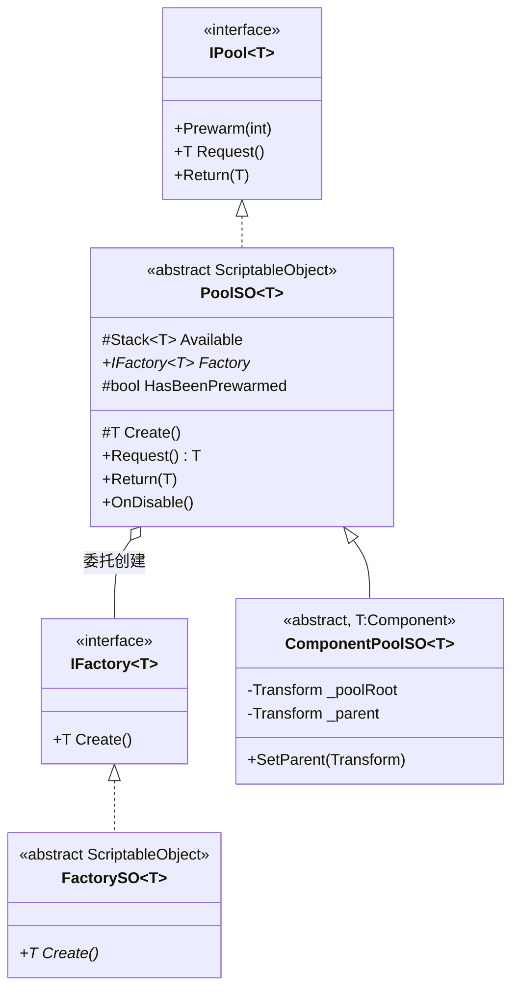
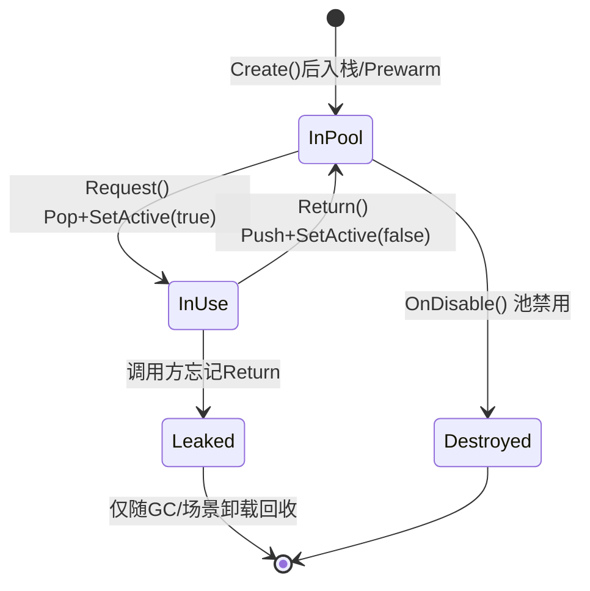
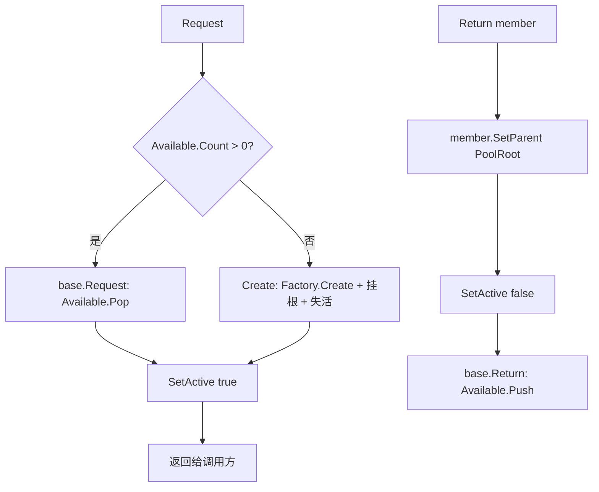

# Pool 模块解析（含 Factory）

> 坐标：**核心底座 · 优先级 1**。依赖 `Factory`（`IFactory<T>`）。被 `Audio`(`SoundEmitterPoolSO`)、示例 `ParticlePoolSO` 等依赖。
> 源码位置：`Assets/Scripts/Pool/`、`Assets/Scripts/Factory/`。

---

## 一、契约定义

### 核心接口/类清单

| 文件 | 角色 | 可见性 |
|---|---|---|
| `Factory/IFactory.cs` | 创建契约：`T Create()` | `public interface IFactory<T>` |
| `Factory/FactorySO.cs` | 把工厂落到 `ScriptableObject` 资产上 | `public abstract class FactorySO<T> : ScriptableObject` |
| `Pool/IPool.cs` | 池契约：`Prewarm/Request/Return` | `public interface IPool<T>` |
| `Pool/PoolSO.cs` | 通用池实现（栈 + 工厂按需创建）| `public abstract class PoolSO<T> : ScriptableObject` |
| `Pool/ComponentPoolSO.cs` | Component 专用池（挂场景层级、控激活态）| `public abstract class ComponentPoolSO<T> : PoolSO<T> where T:Component` |

### 穿透语法的关键设计约束（基于源码）

1. **池本身是 ScriptableObject 资产，而非运行时单例。** `PoolSO<T> : ScriptableObject`。这意味着池的「身份」是一份磁盘资产（`.asset`），多个场景/对象通过 `[SerializeField]` 引用同一份资产即共享同一个池——天然的「无 Manager 的全局共享」。
2. **创建逻辑被外包给注入的工厂，而非池内 `new`。** `PoolSO.Create()` 调 `Factory.Create()`。池只负责「借还」，不负责「怎么造」。`ParticleFactorySO.Create()` 是 `new GameObject(...).AddComponent`，`SoundEmitterFactorySO.Create()` 是 `Instantiate(prefab)`——同一个池骨架可换不同造物策略。
3. **`Prewarm` 一生只能成功一次。** `HasBeenPrewarmed` 守卫，二次调用只警告不重复填充。这是为了避免重复预热导致池规模翻倍。
4. **可用对象存于 `Stack<T>`（LIFO）而非 `Queue`。** `Request` 走 `Pop`，`Return` 走 `Push`。LIFO 让刚归还的对象最先被复用，缓存局部性更好；池不追踪「已借出」的对象，借出后所有权完全交给调用方。
5. **`ComponentPoolSO` 额外维护一个场景层级根 `_poolRoot`。** 归还/创建时 `SetParent(PoolRoot)` + `SetActive(false)`，借出时 `SetActive(true)`。即「回收 = 失活并挂回根节点」，「借出 = 激活」。

### 类图

---

## 二、生命周期与内存

### 动词语义表

| 操作 | 做什么 | 内存语义 |
|---|---|---|
| `Prewarm(n)` | 循环 `n` 次 `Create()` 推入栈；置 `HasBeenPrewarmed` | **批量分配**：一次性预创建 n 个对象 |
| `Create()` | 调 `Factory.Create()`；Component 版额外挂根节点+失活 | **分配**：每次 `new`/`Instantiate` 一个新对象 |
| `Request()` | 栈非空则 `Pop`，否则 `Create()`；Component 版额外 `SetActive(true)` | **零分配（命中）/ 分配（未命中）** |
| `Request(num)` | `new List<T>(num)` 装 num 个 `Request()` 结果 | **分配一个 List 容器**（注意：每次调用都新建 List）|
| `Return(member)` | `Push` 回栈；Component 版先挂根节点+失活 | **释放回池**：对象不销毁，引用入栈待复用 |
| `Return(IEnumerable)` | 逐个 `Return` | 无额外分配 |
| `OnDisable()` | `Available.Clear()` + 复位 prewarm 标记；Component 版 `Destroy(_poolRoot)` | **整池释放**：清空栈引用，销毁根节点及其所有子物体 |

### 状态机（单个池对象视角）

> **关键穿透点**：池不记录「借出中」的对象。一旦 `Request` 出去而调用方不 `Return`，该对象就脱离池管理（`Leaked` 态），池无法主动回收它。复用纪律完全依赖调用方自律——这是仿写时最易翻车处。

### 关键流程：Request / Return（ComponentPool）

---

## 三、跨层桥接

- **核心层 ↔ 注入点**：`PoolSO.Factory` 是抽象属性，具体池（如 `ParticlePoolSO`、`SoundEmitterPoolSO`）用 `[SerializeField]` 持有一个具体 `FactorySO` 资产，并实现 getter/setter 做 `as` 向下转型。这就是「创建策略注入」的接缝。
- **核心层 ↔ 上层（Audio）**：`AudioManager.Awake()` 调 `_pool.Prewarm(_initialSize)` + `_pool.SetParent(transform)`；播放时 `_pool.Request()`，结束时 `_pool.Return(emitter)`。上层不关心 SoundEmitter 怎么造，只借还。
- **跨层 DTO**：池不传 DTO，传的是**对象引用本身**。`ComponentPoolSO` 通过「激活态 + 父节点」作为对象「在池/在用」的隐式状态位，无独立元数据快照。
- **生命周期绑定技巧**：`SetParent` 注释指出——若父节点是 `DontDestroyOnLoad`，则整个池也变成跨场景存活。这是用 Transform 父子关系「借用」Unity 的生命周期管理（未在本仓库验证 DontDestroyOnLoad 传染行为，但属 Unity 既定语义）。

---

## 四、落地难点（脱离框架仿写时最有价值的 3 点）

1. **「池即资产」的共享语义难复刻。** 在非 Unity 环境没有 ScriptableObject 的「磁盘资产即共享实例」机制。要复刻「多处引用同一池」，需用单例/DI 容器显式管理池实例的生命周期，并自己解决「`OnDisable` 何时触发清理」——SO 是 Unity 在卸载时自动调 `OnDisable`，普通对象要手动 `Dispose`。

2. **Component 池的「激活态即状态位」是隐式不变量。** 借出必激活、归还必失活、`Create` 时即失活。漏掉任一步，会出现「池里的对象还在 Update / 渲染」或「借出的对象不可见」。仿写时若用普通对象，要自己定义等价的「启用/挂起」开关，并保证三处（Create/Request/Return）一致。

3. **无借出追踪 → 无法防重复归还 / 防泄漏。** 源码 `Return` 直接 `Push`，不校验该对象是否本就属于本池、是否已在栈中。重复 `Return` 同一对象会让它在栈里出现两次，后续被两个调用方同时 `Request` 到——典型的「double free」式 bug。健壮仿写需引入 `HashSet` 记录在池集合做幂等校验（原版为性能砍掉了，属有意取舍）。
