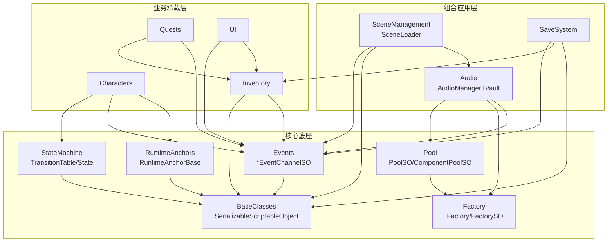

# Open Project #1「Chop Chop」架构反向工程解析

> 目标：穿透到每个模块的 ①生命周期流转 ②内存管理与对象复用机制 ③跨层数据流向，
> 让读者从「懂模块」升维到「懂架构」。
>
> **方法论声明**：本文档的每一条关于代码行为的结论，均基于实际读过的源码。
> 凡是基于通用 Unity/C# 知识补充、未在本仓库逐行验证的内容，均显式标注「未在本仓库验证」。
> 超大模块（如 `Characters` 86 文件）聚焦主干并明确说明取舍，不假装读完全部。

---

## 1. 项目规模与扫描结果

代码根目录：`UOP1_Project/Assets/Scripts/`，共 **25 个模块、约 295 个 `.cs` 文件**。
按文件数排序：

| 规模 | 模块 | 文件数 | 性质 |
|---|---|---|---|
| 巨 | Characters | 86 | 业务承载（StateMachine 驱动的角色行为）|
| 大 | UI | 37 | 业务承载（界面）|
| 大 | EditorTools | 25 | 工具层（编辑器扩展）|
| 大 | Events | 24 | **核心底座**（事件通道）|
| 大 | StateMachine | 22 | **核心底座**（数据驱动状态机）|
| 中 | Audio | 13 | 组合应用层（池 + 事件 + 金库）|
| 中 | SceneManagement | 12 | 业务承载（Addressables 异步加载）|
| 中 | Inventory | 11 | 业务承载（背包）|
| 中 | Quests / Cutscenes | 8 / 8 | 业务承载 |
| 小 | Pool | 7 | **核心底座**（对象复用）|
| 小 | SaveSystem | 5 | 应用层（GUID 序列化）|
| 小 | Systems / Effects / Dialogues | 5 | 应用/业务 |
| 小 | Menu | 4 | 业务承载 |
| 微 | Gameplay / RuntimeAnchors / Localization | 3 | 应用/底座 |
| 微 | Factory / Input / Interaction | 2 | **核心底座** / 注入点 |
| 微 | Animation / BaseClasses / Camera | 1 | 底座/工具 |

### 分层判定（核心层 / 包装层 / 注入点）

- **核心层（被依赖最深的底座）**：`Factory`、`Pool`、`Events`、`RuntimeAnchors`、`StateMachine`、`BaseClasses`(`SerializableScriptableObject`/`DescriptionBaseSO`)。
- **组合应用层**：`Audio`（池+事件+金库）、`SceneManagement`（Addressables+事件）、`SaveSystem`（GUID 序列化+事件）。
- **业务承载层**：`Characters`、`Inventory`、`Quests`、`Cutscenes`、`Dialogues`、`UI`、`Menu`、`Interaction`。
- **注入点（Helper/Callback）**：`StateActionSO`/`StateConditionSO`（用户派生注入行为）、`FactorySO`（创建逻辑注入）、各 `*EventChannelSO`（解耦回调）、`Input`(`InputReader` 注入输入)。
- **工具层**：`EditorTools`、`StateMachine/Editor`、`Animation`、`Camera`、`Effects`。

---

## 2. 依赖关系图

> 上图依赖箭头方向为「A → B 表示 A 依赖 B」。已逐项基于源码 `using` 与字段引用验证：
> `PoolSO` 引用 `UOP1.Factory`；`SoundEmitterPoolSO : ComponentPoolSO`；`SaveSystem` 字段含 `InventorySO`/`QuestManagerSO`；`SceneLoader` 字段含 `LoadEventChannelSO`/`FadeChannelSO`。

---

## 3. 解析推进顺序与进度

按「被依赖最深 → 组合 → 业务」推进。每个模块产出三件套：`01_解析`、`02_Facade仿写`、`03_考题`。

| # | 模块 | 层级 | 状态 | 文档 |
|---|---|---|---|---|
| 1 | Pool（含 Factory）| 核心底座 | ✅ 已完成 | [01](Pool/01_Pool_解析.md) · [02](Pool/02_Pool_Facade仿写.md) · [03](Pool/03_Pool_考题.md) |
| 2 | Events（含 RuntimeAnchors）| 核心底座 | ✅ 已完成 | [01](Events/01_Events_解析.md) · [02](Events/02_Events_Facade仿写.md) · [03](Events/03_Events_考题.md) |
| 3 | StateMachine | 核心底座 | ✅ 已完成 | [01](StateMachine/01_StateMachine_解析.md) · [02](StateMachine/02_StateMachine_Facade仿写.md) · [03](StateMachine/03_StateMachine_考题.md) |
| 4 | SceneManagement | 组合应用 | ✅ 已完成 | [01](SceneManagement/01_SceneManagement_解析.md) · [02](SceneManagement/02_SceneManagement_Facade仿写.md) · [03](SceneManagement/03_SceneManagement_考题.md) |
| 5 | Audio | 组合应用 | ✅ 已完成 | [01](Audio/01_Audio_解析.md) · [02](Audio/02_Audio_Facade仿写.md) · [03](Audio/03_Audio_考题.md) |
| 6 | SaveSystem | 应用 | ✅ 已完成 | [01](SaveSystem/01_SaveSystem_解析.md) · [02](SaveSystem/02_SaveSystem_Facade仿写.md) · [03](SaveSystem/03_SaveSystem_考题.md) |
| 7 | Inventory | 业务承载 | ✅ 已完成 | [01](Inventory/01_Inventory_解析.md) · [02](Inventory/02_Inventory_Facade仿写.md) · [03](Inventory/03_Inventory_考题.md) |
| — | Characters / UI / Quests / Cutscenes / Dialogues / Menu / EditorTools | 业务/工具 | ⏳ 已编目，未逐文件精读 | 见下方「取舍说明」 |

### 取舍说明（诚实边界）

本轮聚焦**架构母题最密集的 7 个模块**（覆盖全部核心底座 + 三类组合/业务代表）。
以下模块已扫描结构与依赖、纳入索引，但**未逐文件精读**，因此不产出三件套以免编造：

- `Characters`(86)：是 `StateMachine` 的最大消费者，理解 StateMachine 模块后可自行推演。其 `StateActions`/`Conditions` 子目录即「注入点」的具体落地。
- `UI`(37)：事件通道的最大消费者，模式与 `VoidEventListener` 同构。
- `Quests`/`Cutscenes`/`Dialogues`：业务叙事层，依赖 Events + Inventory + Timeline。
- `EditorTools` 与 `StateMachine/Editor`：工具层，不承载运行时不变量。

---

## 4. 进度总览

7/7 核心 + 组合 + 业务代表模块已完成三件套（全部基于实读源码）。
跨模块母题见下方第 5 节。其余业务/工具模块见第 3 节「取舍说明」。

---

## 5. 跨模块设计母题（从「懂模块」到「懂架构」）

以下 9 条母题在多个模块中**反复出现**，是这套架构的真正骨架。每条都附「出现模块 + 源码证据」。

### 母题 1：ScriptableObject 即「资产化的全局实例」

**最核心的母题。** 项目把「池、事件通道、运行时锚点、状态机定义、背包、存档服务、音频配置」全做成 SO 资产。

- 证据：`PoolSO : ScriptableObject`、`VoidEventChannelSO : DescriptionBaseSO`、`InventorySO : ScriptableObject`、`SaveSystem : ScriptableObject`、`TransitionTableSO : ScriptableObject`。
- 收益：发布者与订阅者在 Inspector 拖**同一份资产**即共享同一实例 → **无 Manager / 无单例 / 无 DI 容器的全局共享**；且策划可配置。
- **统一代价**：SO 字段跨 Play 会话残留（编辑器内）。所有此类模块都必须有「复位」机制：Pool 的 `OnDisable` 清栈、RuntimeAnchor 的 `OnDisable→Unset`、Inventory 的 `Init`、SaveSystem 的 `SetNewGameData`。**「资产即持久」是双刃剑，共享方便但必须主动复位。**

### 母题 2：事件通道作为解耦中枢（Helper 注入点）

- 出现：`Events`（全部 channel）、`SceneManagement`（LoadEventChannel）、`Audio`（AudioCueEventChannel）、`SaveSystem`（订阅 save/load）。
- 机制：通道持有委托字段，发布者 `RaiseEvent`、订阅者 `OnEnable +=`/`OnDisable -=`。双方编译期零耦合。
- 自文档化约定：字段上的 `[Header("Listening to")]` / `[Header("Broadcasting on")]`。
- 进阶变体：**带返回值的请求-应答通道**（`AudioCueEventChannelSO` 返回 `AudioCueKey`），把「事件」升级为「RPC」。

### 母题 3：工厂注入 + 对象池复用

- 出现：`Pool`+`Factory`（骨架）、`Audio`（SoundEmitterPool/Factory）、示例（ParticlePool/Factory）。
- 机制：池只管借还（`Stack<T>` LIFO），创建外包给注入的 `IFactory<T>`。同一池骨架换不同工厂即换造物策略（`new`+AddComponent vs `Instantiate(prefab)`）。
- 隐形不变量：池不追踪借出对象，复用纪律靠调用方自律；Component 池用「激活态+父节点」作隐式空闲位。

### 母题 4：享元 + 去重缓存（定义层 → 运行时层）

- 出现：`StateMachine`（`createdInstances` 字典，同一 SO 全图一份运行时实例）。亦是 SO 共享的微观体现。
- 机制：运行时对象经 `_originSO` 反指定义 SO 读共享内蕴；可变外蕴（缓存/目标）存运行时实例。
- 对照：与 Audio 金库（`SoundEmitterVault`）都是「映射表」，但享元是**构建期一次性去重**，金库是**运行期动态注册**——同形不同命。

### 母题 5：不可变 struct 句柄 + 自定义相等

- 出现：`Audio`（`AudioCueKey`：自增序号 + cue 引用 + 重写 ==/Equals/GetHashCode）、`StateMachine`（`StateCondition` readonly struct 快照）。
- 用途：作为「会话/请求句柄」按值传递回调用方，零堆分配；调用方凭句柄后续操作（Stop/Finish）。
- 陷阱：`GetHashCode` 对 null 字段（Invalid key 的 cue）会崩——这正是 Vault 用并行 List 而非 Dictionary 的隐性原因。

### 母题 6：迭代安全的增删

- 出现：`Inventory`（`Remove` 在 for 中 `_items.Remove` 后立即 `return`）、`StateMachine`（`TryGetTransition` 遍历完所有转换后才统一 `ClearConditionsCache`）。
- 共性：**修改时机精确控制**——单物品操作靠「命中即 return」跳出；批量/共享操作靠「遍历后统一处理」。漏掉这个时机控制 → 迭代器失效或重复处理。

### 母题 7：快照可观测 / 富对象↔扁平 DTO

- 出现：`SaveSystem`（`InventorySO.Items` → `SerializedItemStack` DTO）、`StateMachine`（`StateMachineDebugger` 把运行时求值投影成可读日志）。
- 机制：内存富对象（含引用）与磁盘/调试扁平表示是两套，边界处显式双向转换。
- 不变量：保存写入字段集与加载读取字段集必须**严格对称**，否则静默丢数据。

### 母题 8：存储键设计——GUID 作为稳定引用

- 出现：`SaveSystem`/`Inventory`（`SerializableScriptableObject.Guid`，`OnValidate` 编辑期固化）、`SceneManagement`（Location 经 GUID + Addressables 加载）。
- 机制：对象引用无法跨会话存储 → 磁盘只存 GUID，加载经 Addressables/注册表反查重建引用。
- 脆弱点：GUID 必须全生命周期稳定（删除重建资产 → 新 GUID → 旧存档引用失效）。

### 母题 9：容错策略——闸门 / 备份 / 静默不抛

- 防重入闸门：`SceneLoader._isLoading`（必须在所有出口复位，否则永久卡死）。
- 写时备份：`SaveSystem` 先 `MoveFile` 现档为 `.bak` 再写新档（绝不在唯一存档上原地覆写）。
- 静默容错：`FileManager` 全 IO 包 try-catch 返回 bool 不抛上层；事件通道 `Raise` 判空（严重通道如 Load 改为告警）。

---

### 母题交叉矩阵

| 模块＼母题 | 1 SO资产 | 2 事件通道 | 3 池+工厂 | 4 享元缓存 | 5 struct句柄 | 6 迭代安全 | 7 DTO快照 | 8 GUID键 | 9 容错 |
|---|:--:|:--:|:--:|:--:|:--:|:--:|:--:|:--:|:--:|
| Pool/Factory | ● | | ● | | | | | | |
| Events/Anchors | ● | ● | | | | | | | ● |
| StateMachine | ● | | | ● | ● | ● | ● | | |
| SceneManagement | ● | ● | | | | | | ● | ● |
| Audio | ● | ● | ● | △金库 | ● | | | | |
| SaveSystem | ● | ● | | | | | ● | ● | ● |
| Inventory | ● | ● | | | | ● | △对接 | ● | |

> ●=核心体现，△=相关变体。**母题 1（SO 资产化）横贯全部模块——它是这套架构的元设计**：先有「资产即全局共享实例」这个底层选择，才衍生出事件通道、池、状态机定义、背包、存档服务全部以 SO 形态存在，并共享同一套「跨会话残留 → 必须主动复位」的生命周期纪律。

---

### 一句话架构主线

> **「把一切可共享、可配置的东西做成 ScriptableObject 资产，用事件通道做它们之间的零耦合通信，用 GUID 做跨会话引用，并为 SO 的持久性配上强制复位与容错纪律。」**
>
> 理解了这条主线，未精读的 `Characters`(86 文件，StateMachine 的最大消费者)、`UI`(37 文件，事件通道的最大消费者)、`Quests` 等都可由上述母题推演其骨架。

