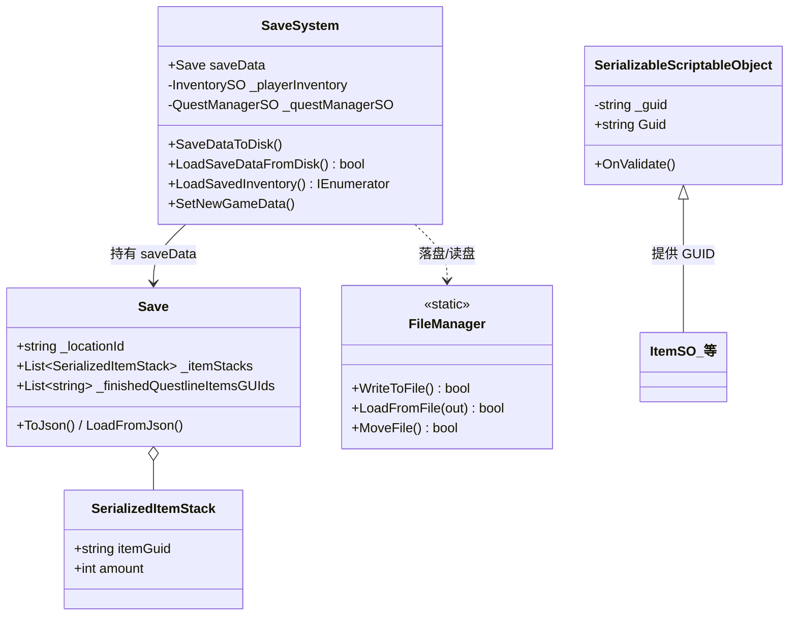
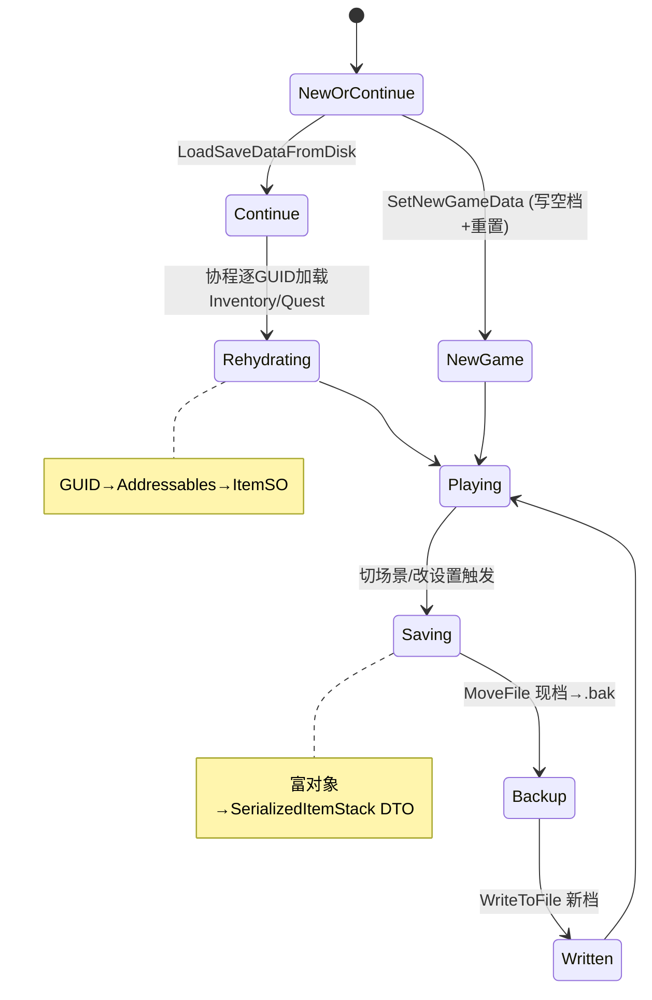
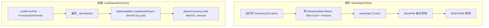

# SaveSystem 模块解析

> 坐标：**应用层 · 优先级 6**。依赖 `Events`(VoidEventChannelSO/LoadEventChannelSO)、`Inventory`(InventorySO/ItemSO)、`Quests`(QuestManagerSO)、`Systems`(SettingsSO)、Unity Addressables。被 `StartGame`、`Menu` 协作。
> 源码位置：`Assets/Scripts/SaveSystem/`。

---

## 一、契约定义

### 核心类清单

| 文件 | 角色 | 可见性 |
|---|---|---|
| `SaveSystem.cs` | 中枢：收集运行时状态 → 序列化落盘 / 反序列化重建 | `public class : ScriptableObject` |
| `Save.cs` | 存档数据结构（DTO，`[Serializable]`，含 To/FromJson）| `public class Save` |
| `FileManager.cs` | 纯静态文件 IO（写/读/移动，带 try-catch）| `public static class` |
| `SerializedItemStack.cs` | 物品栈的可序列化形态（GUID + 数量）| `[Serializable] public class` |
| `SerializableScriptableObject.cs` | **GUID 存储键的根**：所有需被引用持久化的 SO 基类 | `public class : ScriptableObject` |

### 穿透语法的关键设计约束（基于源码）

1. **持久化的「键」是资产 GUID，不是名字或路径。** `SerializableScriptableObject` 在 `OnValidate`（编辑器）里把 `AssetDatabase.GetAssetPath(this)` 转成 GUID 存入隐藏字段 `_guid`。运行时序列化只存 GUID（如 `SerializedItemStack.itemGuid`、`Save._locationId`、`_finishedQuestlineItemsGUIds`），加载时经 `Addressables.LoadAssetAsync<T>(guid)` 反查回真实 SO。这是整套存档的「引用持久化」根基。
2. **`SaveSystem` 本身是 ScriptableObject 资产，作为全局可引用的存档服务。** 与 Pool/Events 同构——多个系统（`StartGame`、`SceneLoader` 间接、`Menu`）通过 `[SerializeField] SaveSystem` 引用同一份资产，共享 `saveData`。
3. **`Save` 是纯数据 DTO，序列化用 `JsonUtility`。** `ToJson()` / `LoadFromJson()`（`FromJsonOverwrite` 就地覆写）。字段刻意 public（注释：避免写 trivial getter/setter）。它聚合了位置、背包、任务、音量、画质、本地化等所有可存状态。
4. **「运行时对象 → 可序列化形态」的转换在落盘前显式做。** `SaveDataToDisk` 先 `saveData._itemStacks.Clear()` 再把 `_playerInventory.Items`（运行时 ItemStack，含 ItemSO 引用）转成 `SerializedItemStack`（GUID + amount）；任务同理。即「内存富对象」与「磁盘扁平 DTO」是两套表示，落盘/加载时互转。
5. **写盘前先备份（写时移动）。** `SaveDataToDisk` 调 `FileManager.MoveFile(saveFilename, backupSaveFilename)` 把现有存档移为 `.bak`，再写新文件——容错策略：写新档若崩溃，旧档已存为备份。
6. **`FileManager` 全部 IO 包 try-catch 返回 bool，绝不抛到上层。** 写/读/移动失败只 `Debug.LogError` 并返回 false。`LoadFromFile` 在文件不存在时先创建空文件再读（保证后续读不失败）。
7. **存档触发点经事件解耦。** `SaveSystem.OnEnable` 订阅 `_saveSettingsEvent`(Void，存设置) 与 `_loadLocation`(Load，缓存当前 Location GUID 并落盘)——即「每次切场景自动存档当前位置」。

### 类图

---

## 二、生命周期与内存

### 动词语义表

| 操作 | 做什么 | 内存/IO 语义 |
|---|---|---|
| `OnValidate`（编辑器）| 资产路径 → GUID 写入 `_guid` | 仅编辑器；运行时 GUID 已固化 |
| `SaveDataToDisk` | 富对象→DTO（清空+重填）→ 备份旧档 → 写新档 | List 清空重填（GC）；两次文件 IO（move+write）|
| `LoadSaveDataFromDisk` | 读文件 → `FromJsonOverwrite` 就地覆写 saveData | 一次读 IO；DTO 字段被覆写 |
| `LoadSavedInventory`（协程）| 清空背包 → 逐 GUID `Addressables.LoadAssetAsync<ItemSO>` → Add | 逐项异步加载 SO（分配）；yield 等待 |
| `SetNewGameData` | 写空档 → 背包 Init → 任务 Reset → 落盘 | 重置内存状态 + 写盘 |
| `CacheLoadLocations`（事件回调）| 记录目标 Location GUID → 落盘 | 切场景即存档 |
| `FileManager.MoveFile` | 删旧 .bak → 移现档为 .bak | 文件系统移动 |

### 状态机（一次完整存读档周期）

### 关键流程：保存与加载的对称转换

---

## 三、跨层桥接

- **GUID 作为跨「内存↔磁盘」的稳定键**：`SerializableScriptableObject.Guid` 是唯一能跨会话、跨打包稳定标识一个 SO 资产的键。背包物品、任务、Location 都靠 GUID 在磁盘 DTO 与内存 SO 之间往返。这是「存储键设计」母题最纯粹的体现。
- **DTO 边界**：`Save` + `SerializedItemStack` 构成磁盘表示层；`InventorySO`/`ItemSO`/`QuestManagerSO` 是内存表示层。SaveSystem 是两层之间的双向翻译器，转换逻辑集中在 `SaveDataToDisk`（出）与 `LoadSaved*`（入）。
- **事件注入点**：SaveSystem 订阅 `_saveSettingsEvent`、`_loadLocation` 被动触发存档，不主动轮询。`StartGame` 则主动调 `LoadSaveDataFromDisk`/`SetNewGameData`/`LoadSavedInventory`（协程）来编排新游戏/继续游戏。
- **异步反水合（rehydration）**：加载背包是协程，因为每个 ItemSO 经 Addressables 异步加载（可能从 AssetBundle/远端）。`StartGame.LoadSaveGame` 用 `yield return StartCoroutine(...)` 串行等背包加载完，再加载 Location——存在明确的加载顺序依赖。
- **与 SceneManagement 协作**：两者都订阅 `_loadLocation`。SceneLoader 负责加载场景，SaveSystem 负责把该 Location 的 GUID 写盘——同一事件，双消费者，职责正交。

---

## 四、落地难点（脱离框架仿写时最有价值的 3 点）

1. **「引用持久化」必须靠稳定 GUID，而非对象指针/名字。** 内存里 `ItemStack` 持有 `ItemSO` 引用，但引用无法跨会话存储。核心技巧是给每个可被引用的资产一个编辑期固化的 GUID（`OnValidate` 写入），磁盘只存 GUID，加载时经资产数据库反查重建引用。脱离 Unity Addressables，需自建「GUID → 资产」注册表，并保证 GUID 在资产移动/重命名后仍稳定——这是序列化系统最难维护的不变量。

2. **富对象与扁平 DTO 的双向转换必须穷尽且对称。** `SaveDataToDisk` 每次都 `Clear()` 再重填 DTO 列表——若漏掉某类状态（如新增了 Buff 系统忘记加进 Save），存档会静默丢失该状态。仿写时「保存写入的字段集合」与「加载读取的字段集合」必须严格对称，任何一边遗漏都导致数据丢失或加载错位。

3. **写时备份（write-temp-then-rename）是抗崩溃的关键容错。** 源码 `MoveFile(现档→.bak)` 再写新档：若写新档过程中崩溃/断电，旧档仍以 `.bak` 完好存在。更健壮的工业做法是「写临时文件 → 校验 → 原子 rename 覆盖」，但原版的「先备份再写」已抓住核心——**永远不要在唯一一份存档上原地覆写**。仿写时若直接 `WriteAllText(savefile)` 覆盖，一次写入中断就永久损坏存档。
