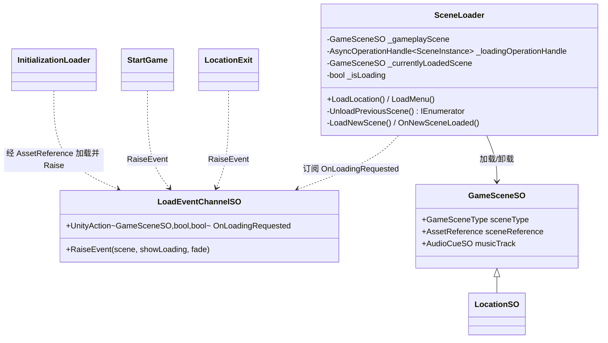
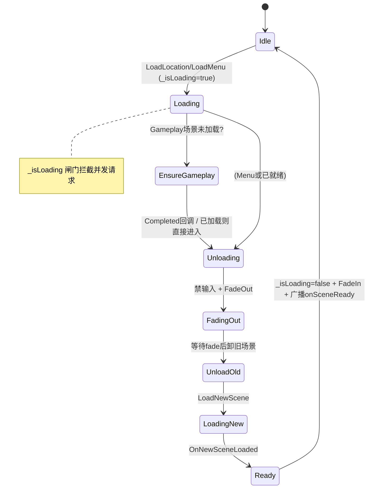
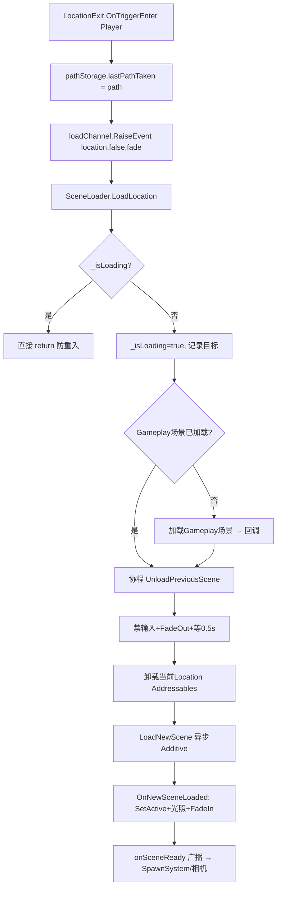

# SceneManagement 模块解析

> 坐标：**组合应用层 · 优先级 4**。依赖 `Events`(LoadEventChannelSO/FadeChannelSO/BoolEventChannelSO/VoidEventChannelSO)、`BaseClasses`(GameSceneSO)、`Input`(InputReader)、Unity Addressables。被 `SaveSystem`、`UI`、`Audio`(场景音乐) 协作。
> 源码位置：`Assets/Scripts/SceneManagement/`。

---

## 一、契约定义

### 核心类清单

| 文件 | 角色 | 可见性 |
|---|---|---|
| `SceneLoader.cs` | 场景加载/卸载状态机（核心编排者）| `public class : MonoBehaviour` |
| `InitializationLoader.cs` | 冷启动引导：加载常驻管理器场景 + 触发主菜单 | `public class : MonoBehaviour` |
| `StartGame.cs` | 新游戏/继续游戏的入口编排 | `public class : MonoBehaviour` |
| `LocationExit.cs` | 触发器：进入则请求加载下一 Location | `public class : MonoBehaviour` |
| `LocationEntrance.cs` | 入口：根据来路设置相机优先级 | `public class : MonoBehaviour` |
| `ScriptableObjects/GameSceneSO.cs` | 场景元数据基类（类型/AssetReference/音乐）| `public class : DescriptionBaseSO` |
| `ScriptableObjects/LocationSO.cs` | Location 专属（含本地化名）| `: GameSceneSO` |
| `ScriptableObjects/PathSO.cs` | 无方向的「路径」标记，连接出入口 | `: ScriptableObject`（空类，纯标识）|
| `ScriptableObjects/PersistentManagersSO/GameplaySO/MenuSO` | 特殊场景类型元数据 | `: GameSceneSO` |

### 穿透语法的关键设计约束（基于源码）

1. **场景不直接 `SceneManager.LoadScene("name")`，而经 `GameSceneSO.sceneReference`（Addressables `AssetReference`）异步加载。** 这让场景成为可按需打包/下载的资源，且持有 `AsyncOperationHandle<SceneInstance>` 作为后续卸载的句柄。
2. **加载请求全经 `LoadEventChannelSO` 事件通道，`SceneLoader` 是唯一订阅者。** 任意场景的 `LocationExit`/`StartGame`/`UI` 只管 `RaiseEvent(targetScene, showLoading, fade)`，不知道谁在加载——`SceneLoader` 在 `OnEnable` 订阅 `_loadLocation`/`_loadMenu`/`_coldStartupLocation`。
3. **`_isLoading` 是防重入闸门。** 注释明确：玩家可能一帧内同时落入两个 Exit 触发器，`LoadLocation`/`LoadMenu` 开头 `if (_isLoading) return;` 防止并发加载请求互相踩踏。它在 `OnNewSceneLoaded` 末尾才复位。
4. **加载是一条「带 fade 的协程流水线」**：`UnloadPreviousScene`（禁输入→FadeOut→等待→卸旧场景）→ `LoadNewScene`（显 loading→异步加载新场景）→ `OnNewSceneLoaded`（设为活动场景→重建光照探针→FadeIn→广播 `_onSceneReady`）。
5. **常驻 Gameplay 管理器场景的「按需加载/卸载」逻辑。** 从主菜单进 Location 时，若 Gameplay 管理器场景未加载则先 `LoadSceneAsync(Additive)` 再继续；从 Location 回主菜单时 `UnloadSceneAsync` 掉它。即「管理器场景」只在玩法期间存在。
6. **`_onSceneReady`（VoidEventChannelSO）是「场景就绪」的下游触发点。** `StartGameplay()` 广播它，SpawnSystem 据此生成玩家、`LocationEntrance` 据此安排相机转场。加载器不直接调用这些系统，仍走事件解耦。
7. **冷启动（编辑器直接 Play 某 Location）特例**：`LocationColdStartup`（仅 `UNITY_EDITOR`）同步 `WaitForCompletion()` 加载 Gameplay 管理器，因为开发者跳过了 Initialization 流程。卸载这种场景时也要用原生 `SceneManager.UnloadSceneAsync`（因为 handle 未经 Addressables 使用）。

### 类图

---

## 二、生命周期与内存

### 动词语义表

| 操作 | 做什么 | 内存/资源语义 |
|---|---|---|
| `InitializationLoader.Start` | 异步加载常驻管理器场景，完成后加载主菜单通道并 Raise | 分配 SceneInstance + 加载 LoadEventChannelSO 资产 |
| `LoadLocation/LoadMenu` | 记录目标/参数，置 `_isLoading`，按需先加载 Gameplay 场景 | 设状态；可能新增一个 SceneInstance |
| `UnloadPreviousScene`（协程）| 禁输入→FadeOut→等 0.5s→卸旧场景 | **释放**：旧场景经 `UnLoadScene()`(Addressables) 卸载，回收其资源 |
| `LoadNewScene` | （可选显 loading）异步加载新场景 | **分配**：新 SceneInstance + 其全部 GameObject |
| `OnNewSceneLoaded` | 设活动场景、`LightProbes.TetrahedralizeAsync`、复位 `_isLoading`、FadeIn、广播就绪 | 重建光照探针四面体化 |
| `StartGameplay` | `_onSceneReady.RaiseEvent()` | 无分配；触发下游 spawn/相机 |
| 回主菜单时 `Addressables.UnloadSceneAsync(_gameplayManagerLoadingOpHandle)` | 卸载常驻 Gameplay 场景 | **释放**管理器场景 |

### 状态机（SceneLoader 的加载流水线）

### 关键流程：一次 Location → Location 切换

---

## 三、跨层桥接

- **上游触发（注入点）**：所有「我想切场景」都经 `LoadEventChannelSO.RaiseEvent`。触发者（`LocationExit` 触发器、`StartGame` 按钮响应、`InitializationLoader`）与执行者 `SceneLoader` 零编译耦合，`SceneLoader` 是该通道的唯一订阅者（隐含约束）。
- **下游通知**：`SceneLoader` 通过 `_toggleLoadingScreen`(Bool)、`_fadeRequestChannel`(Fade)、`_onSceneReady`(Void) 三个通道广播加载阶段，UI/相机/SpawnSystem 各自订阅。
- **跨层 DTO**：`GameSceneSO`（及子类 `LocationSO`/`MenuSO`）是场景的不可变元数据载体，携带 `AssetReference`（加载句柄来源）+ `musicTrack`（关联音乐，供 Audio 模块）。`PathSO` 是「无方向标识」，配合 `PathStorageSO`（RuntimeAnchor 式存储）记录「上次走的路」以决定入口相机。
- **与 SaveSystem 协作**：`SaveSystem` 也订阅 `_loadLocation`（`CacheLoadLocations`），在每次加载请求时把目标 Location 的 `Guid` 写入存档——即「场景切换即存档点」。`StartGame.ContinuePreviousGame` 反向用存档里的 `_locationId`(GUID) 经 Addressables 加载回对应 LocationSO。
- **资源句柄管理**：卸载依赖加载时保存的 `AsyncOperationHandle`。`_currentlyLoadedScene.sceneReference.OperationHandle.IsValid()` 判断该场景是否经 Addressables 加载过，决定用 Addressables 卸载还是原生 `SceneManager`（冷启动遗留场景）。

---

## 四、落地难点（脱离框架仿写时最有价值的 3 点）

1. **异步加载的「句柄生命周期」最易出错。** 加载返回 `AsyncOperationHandle`，卸载**必须**用同一个 handle（或 `sceneReference.UnLoadScene()`）。源码用 `_gameplayManagerLoadingOpHandle`、`_loadingOperationHandle` 分别缓存。仿写时若加载与卸载句柄不配对、或重复释放同一 handle，Addressables 会泄漏内存或抛异常。冷启动场景因「handle 未被使用过」还需走原生卸载——这种「两套卸载路径」是真实工程的脏细节。

2. **防重入闸门 `_isLoading` 的复位时机是单点真理。** 它在请求入口置 true，在 `OnNewSceneLoaded`（加载彻底完成）置 false。若提前在 `LoadNewScene` 就复位，则加载途中的第二个请求会插入；若某条异常路径忘记复位，则整个加载器永久卡死（之后所有请求都被 `return`）。仿写时这个布尔的「置位/复位」必须覆盖所有出口路径。

3. **协程化的 fade 流水线把「视觉过渡」与「资源加载」编织在一起。** `UnloadPreviousScene` 先 `FadeOut` 再 `WaitForSeconds(_fadeDuration)` 才卸场景，避免玩家看到场景突然消失。脱离 Unity 协程，需用 async/await 或状态机显式编排「淡出→卸载→加载→淡入」的时序，且每步都可能失败需回滚——这是「带 UX 的异步编排」，比单纯 `await Load()` 复杂得多。
