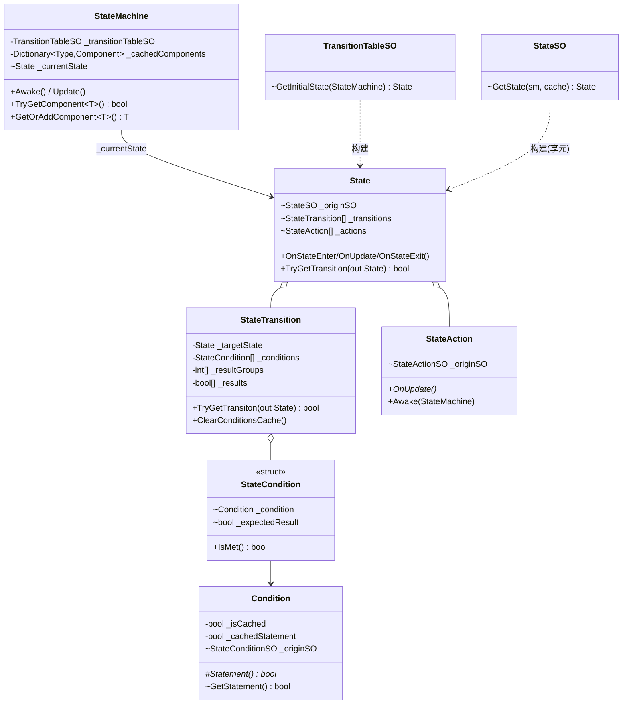
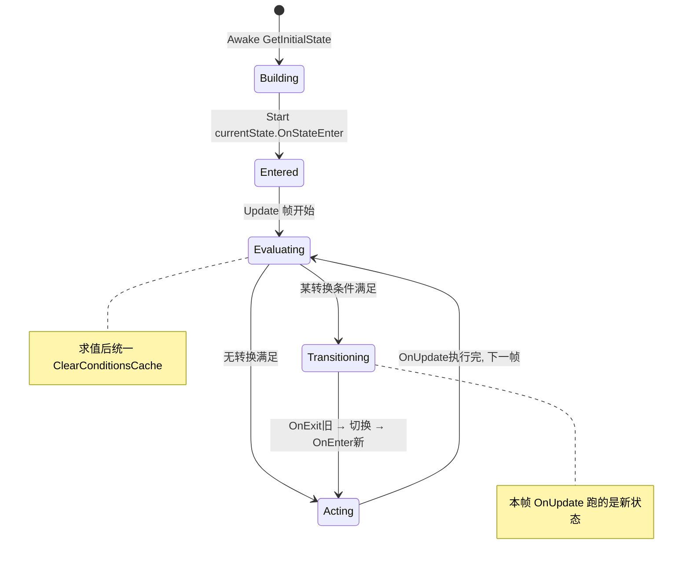
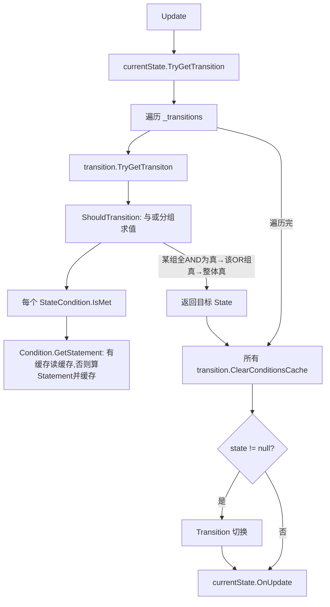

# StateMachine 模块解析

> 坐标：**核心底座 · 优先级 3**。依赖 `BaseClasses`。被 `Characters`(86 文件) 大规模消费。
> 源码位置：`Assets/Scripts/StateMachine/{Core, ScriptableObjects, Debugging, Utilities, Editor}`。
> 本文聚焦**运行时主干**（Core + ScriptableObjects + Debugging），Editor 子目录（可视化转换表编辑器）属工具层，仅在跨层处提及。

---

## 一、契约定义

### 核心类清单

| 文件 | 角色 | 可见性 |
|---|---|---|
| `Core/StateMachine.cs` | 运行时宿主（MonoBehaviour），驱动 Update/Transition | `public class StateMachine : MonoBehaviour` |
| `Core/State.cs` | 运行时状态：持有 transitions + actions 数组 | `public class State` |
| `Core/StateTransition.cs` | 转换：一组条件 + 目标状态 + 与或分组求值 | `public class StateTransition : IStateComponent` |
| `Core/StateCondition.cs` | `Condition`（抽象，带缓存）+ `StateCondition`(struct，条件+期望值) | `public abstract class Condition` / `readonly struct StateCondition` |
| `Core/StateAction.cs` | 行为基类（OnEnter/OnUpdate/OnExit）| `public abstract class StateAction : IStateComponent` |
| `Core/IStateComponent.cs` | OnStateEnter/OnStateExit 契约 | `interface`（internal）|
| `ScriptableObjects/TransitionTableSO.cs` | **数据定义 + 运行时图构建器** | `public class : ScriptableObject` |
| `ScriptableObjects/StateSO.cs` | 状态定义（持有 actionSO 数组），含享元构建 | `public class : ScriptableObject` |
| `ScriptableObjects/StateActionSO.cs` | 行为定义 + 工厂 `CreateAction()` | `abstract`，泛型版 `StateActionSO<T> where T:StateAction,new()` |
| `ScriptableObjects/StateConditionSO.cs` | 条件定义 + 工厂 `CreateCondition()` | 同上 |
| `Debugging/StateMachineDebugger.cs` | 仅 `UNITY_EDITOR`，转换日志/快照 | `internal class` |

### 穿透语法的关键设计约束（基于源码）

1. **数据层（SO）与运行时层（Core）彻底分离，运行时图在 `Awake` 一次性构建。** `StateMachine.Awake` 调 `_transitionTableSO.GetInitialState(this)`，把整张 SO 定义的「状态-转换-条件-行为」图实例化为运行时 `State[]`/`StateTransition[]`/`Condition[]`/`StateAction[]`，之后运行时再不碰 SO（除读 `_originSO` 取名/共享数据）。
2. **享元模式 + 去重缓存：`Dictionary<ScriptableObject, object> createdInstances`。** 同一个 `StateSO`/`StateActionSO`/`StateConditionSO` 资产在整张图里**只实例化一份运行时对象**。`StateSO.GetState` 先查 `createdInstances`，命中即复用——避免「状态 A 和状态 B 都引用同一 Action」时重复 new，也保证共享条件的求值缓存一致。
3. **运行时对象通过 `_originSO` 反向指回定义 SO（享元的「内蕴状态」）。** `StateAction._originSO`、`Condition._originSO`、`State._originSO`。运行时实例（外蕴状态：缓存、目标引用）轻量，共享数据（外蕴：配置参数、名字）放 SO 上经 `OriginSO` 属性读取。
4. **条件求值带「单帧缓存」，整帧统一清除。** `Condition.GetStatement()` 首次算 `Statement()` 并缓存 `_cachedStatement`，同帧内多次读不重算；`State.TryGetTransition` 在遍历完所有转换后统一 `ClearConditionsCache()`。即「同一条件在一帧内被多个转换复用时只算一次」。
5. **转换条件支持「与/或」分组求值。** `StateTransition._resultGroups` 是「每个 OR 组包含几个 AND 条件」的长度数组。`ShouldTransition` 双层循环：组内 AND 连乘、组间 OR 取或。分组由 `TransitionTableSO.ProcessConditionUsages` 根据 `Operator.And/Or` 从扁平条件列表压缩而成。
6. **`StateMachine` 重写了 `TryGetComponent/GetComponent` 做组件缓存。** `_cachedComponents` 字典缓存 `Type → Component`，Action/Condition 的 `Awake(stateMachine)` 期间可一次性缓存所需组件，避免每帧 `GetComponent`。`GetOrAddComponent` 还能按需 AddComponent。
7. **`Update` 顺序：先判转换再执行当前状态 Action。** `if (TryGetTransition(out s)) Transition(s); _currentState.OnUpdate();`——转换发生时本帧执行的是**新状态**的 OnUpdate（旧状态 OnExit + 新状态 OnEnter 已在 Transition 内完成）。

### 类图

---

## 二、生命周期与内存

### 动词语义表

| 操作 | 做什么 | 内存语义 |
|---|---|---|
| `Awake` | `GetInitialState` 构建整张运行时图 | **集中分配**：所有 State/Transition/Condition/Action 一次性 new（享元去重）|
| `GetState/GetAction/GetCondition` | 查缓存命中则复用，否则 new + 注册缓存 + `Awake` | 命中零分配；未命中一次分配 |
| `Start` | `_currentState.OnStateEnter()` | 无分配；触发各 component 的 enter 钩子 |
| `Update` | 判转换 → (可能)Transition → 当前态 OnUpdate | **稳态零分配**（核心设计目标）|
| `TryGetTransition` | 遍历转换求值，命中即停；末尾清所有条件缓存 | 无分配 |
| `IsMet` | 读条件缓存值与期望值比较；编辑器下记日志 | 无分配（编辑器下 StringBuilder 有）|
| `Transition` | 旧态 OnExit → 换 `_currentState` → 新态 OnEnter | 仅引用切换 |
| `TryGetComponent<T>` | 查 `_cachedComponents`，未命中查真实组件并缓存 | 首次一条字典记录 |

### 状态机（运行时一帧的状态流转）

### 关键流程：转换求值（与/或分组 + 缓存）

---

## 三、跨层桥接

- **数据层 → 运行时层（构建注入点）**：`TransitionTableSO.GetInitialState` 是唯一构建入口。它 `GroupBy(FromState)` 把扁平的 `TransitionItem[]` 聚合成「每个源状态 → 多条出边」，逐条调 `StateSO.GetState` / `StateConditionSO.GetCondition` 构建并用 `createdInstances` 去重，最后回填 `state._transitions`。
- **运行时层 → 用户行为（核心注入点）**：用户**派生** `StateAction`/`Condition` 写业务逻辑，再建对应 `StateActionSO<MyAction>`/`StateConditionSO<MyCond>` 资产（泛型版自动 `new T()`）。这是框架的主扩展缝——`Characters` 模块的全部角色行为都在这里注入。
- **运行时层 ↔ 宿主组件**：Action/Condition 在 `Awake(stateMachine)` 期间通过 `stateMachine.GetOrAddComponent<T>()` 缓存所需组件（如 Rigidbody、移动控制器），运行时直接用缓存引用，避免每帧 GetComponent。
- **跨层 DTO / 快照**：`StateCondition` 是 `readonly struct`——条件 + 期望结果的不可变快照，按值传递。编辑器层通过 `_originSO.name` 把运行时求值结果反投影到可读日志（`StateMachineDebugger`）。
- **共享数据接缝**：运行时对象经 `OriginSO` 属性读 SO 上的配置（享元内蕴），所以**多个状态机实例可共享同一套 SO 定义**，各自只持有轻量运行时实例。

---

## 四、落地难点（脱离框架仿写时最有价值的 3 点）

1. **「定义图 → 运行时图」的享元去重构建最难。** 核心是 `createdInstances` 缓存：同一 SO 在图中被多处引用时只 new 一次。漏掉去重会导致：①同一条件被实例化多份，单帧缓存失效（每份各算一次）；②`OnStateEnter/Exit` 对共享 component 重复触发。仿写时必须在递归构建中传递并复用这张缓存表。

2. **单帧条件缓存的「何时算、何时清」是隐形不变量。** `GetStatement` 缓存、`State.TryGetTransition` 末尾统一 `ClearConditionsCache`。若在每个 transition 求值后立即清缓存，则跨 transition 共享的条件会重复求值（破坏性能优化）；若整帧不清，则下一帧读到陈旧值（破坏正确性）。清除时机必须恰好是「本帧所有转换都求值完之后」。

3. **与/或分组求值的 `_resultGroups` 压缩格式反直觉。** 它不是树而是「扁平条件列表 + 每个 OR 组的 AND 计数」。`ProcessConditionUsages` 把 `[A and B or C]` 压成 `_resultGroups=[2,1]`（第一组 2 个 AND，第二组 1 个）。仿写时若直接存条件树更直观但偏离原版；要 1:1 复刻须理解：求值是「组内连乘 AND，组间累或 OR」，且 `Operator` 属于「当前条件与下一条件之间」的连接符。
