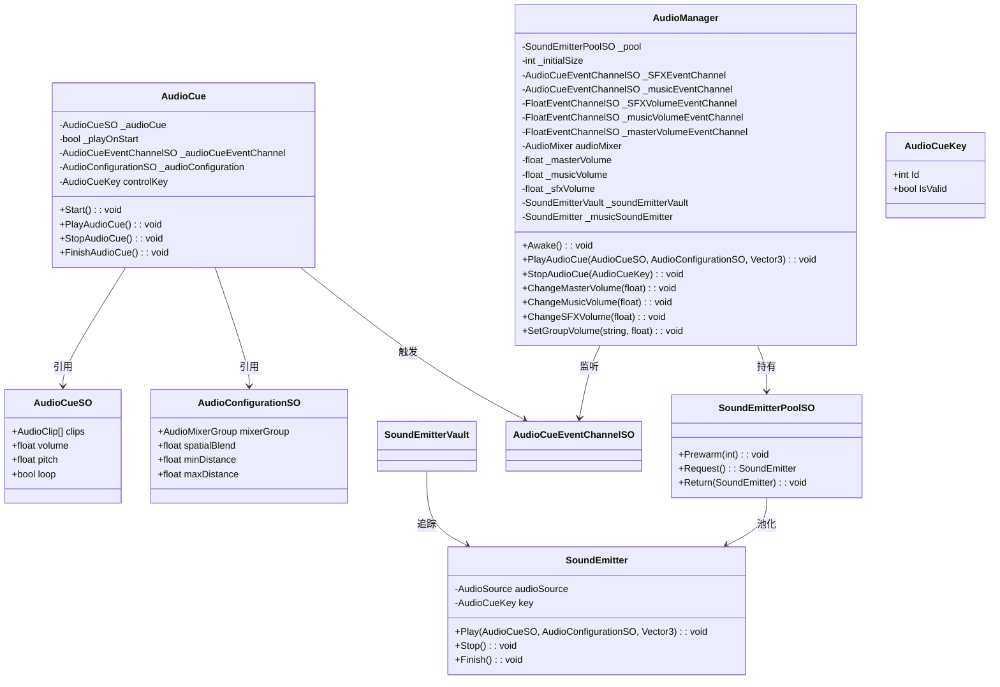
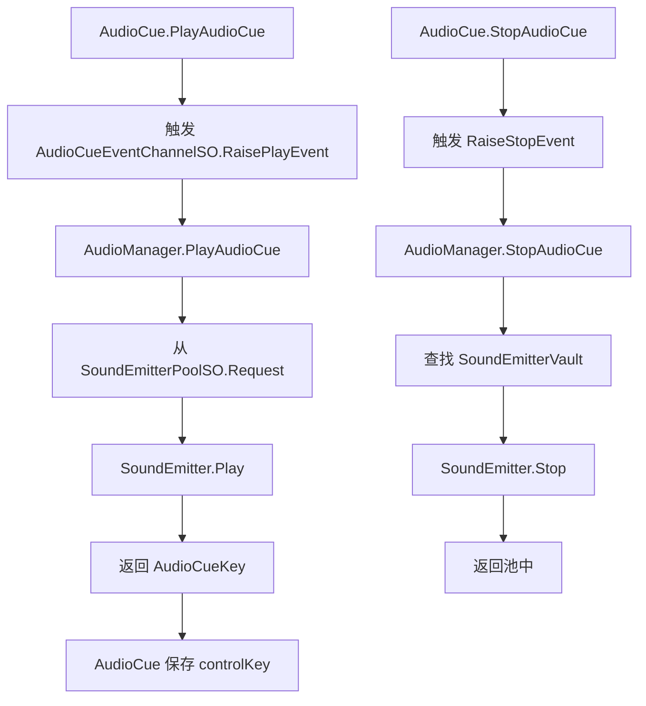

# Audio 模块解析

## 契约定义

### 核心类清单表

| 文件 | 角色 | 可见性 |
|------|------|--------|
| `AudioManager` | 音频管理器（池 + 播放控制） | `public class` |
| `AudioCue` | 音频触发器（MonoBehaviour） | `public class` |
| `AudioCueSO` | 音频配置 SO | `public class` |
| `AudioConfigurationSO` | 音频参数 SO | `public class` |
| `SoundEmitterPoolSO` | 音效发射器池 | `public class` |
| `SoundEmitterVault` | 音效发射器仓库 | `public class` |
| `MusicPlayer` | 音乐播放器 | `public class` |

### 关键设计约束

1. **对象池管理**：`SoundEmitterPoolSO` 继承 `ComponentPoolSO<SoundEmitter>`
2. **事件驱动**：`AudioCueEventChannelSO` 触发播放/停止
3. **控制键机制**：`AudioCueKey` 标识正在播放的音频，用于后续控制
4. **音量分层**：Master、Music、SFX 三层音量控制
5. **AudioMixer集成**：通过 `AudioMixer.SetFloat()` 控制音量

### Mermaid classDiagram

---

## 生命周期与内存

### 动词语义表

| 操作 | 做什么 | 内存分配 |
|------|--------|----------|
| `AudioManager.Awake()` | 创建池，预热 | ✅ 池化对象 |
| `AudioCue.PlayAudioCue()` | 请求播放，获取控制键 | ❌ |
| `AudioManager.PlayAudioCue()` | 从池获取发射器，播放 | ❌ |
| `AudioCue.StopAudioCue()` | 通过控制键停止 | ❌ |
| `AudioManager.ChangeVolume()` | 设置 AudioMixer 参数 | ❌ |

### 音频播放流程

---

## 跨层桥接

### 核心层与上层对接

1. **事件桥接**：`AudioCueEventChannelSO` 触发播放/停止
2. **池桥接**：`SoundEmitterPoolSO` 管理 `SoundEmitter` 复用
3. **音量桥接**：`FloatEventChannelSO` 控制音量

---

## 落地难点

### 难点1：控制键机制

**问题**：需要标识正在播放的音频，用于后续停止/暂停。

**解决方案**：`AudioCueKey` 结构体，包含唯一ID和有效性标志。

### 难点2：对象池与音频播放

**问题**：音频播放是异步的，池化需要考虑播放状态。

**解决方案**：`SoundEmitterVault` 追踪正在播放的发射器，播放完成后返回池中。

### 难点3：音量分层

**问题**：需要独立控制 Master、Music、SFX 音量。

**解决方案**：使用 `AudioMixer` 的多个 Group，通过 `SetFloat()` 控制。

---

## 坐标

- **模块优先级**：P2（业务层，依赖 Pool/Events）
- **依赖**：Pool、Events
- **被依赖**：UI（间接）
