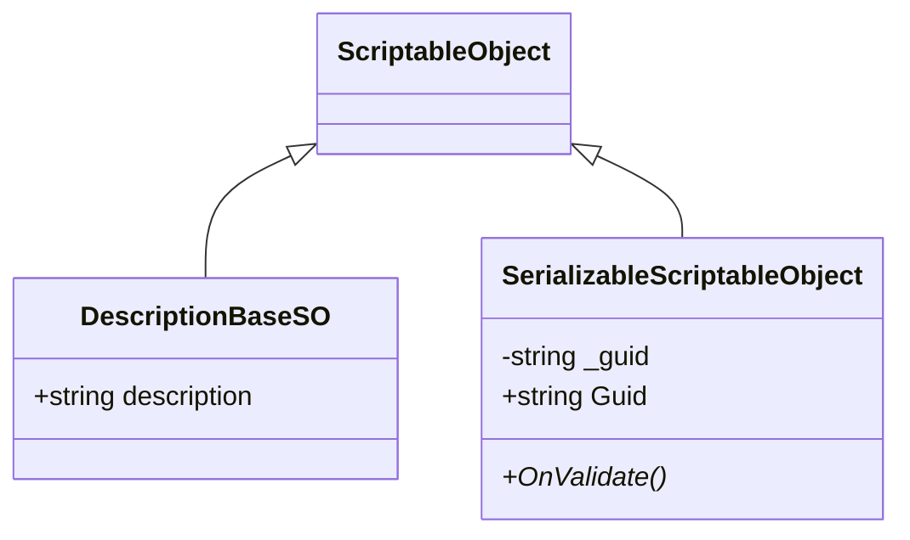

# BaseClasses 模块解析

## 契约定义

### 核心类清单表

| 文件 | 角色 | 可见性 |
|------|------|--------|
| `DescriptionBaseSO` | 带描述字段的 SO 基类 | `public class` |
| `SerializableScriptableObject` | 带 Guid 序列化的 SO 基类 | `public class` |

### 关键设计约束

1. **描述字段**：`DescriptionBaseSO` 提供 `[TextArea] string description`，用于 Inspector 中的注释
2. **Guid 序列化**：`SerializableScriptableObject` 在 `OnValidate()` 中通过 `AssetDatabase.AssetPathToGUID()` 生成唯一标识
3. **持久化**：Guid 字段 `[SerializeField, HideInInspector]` 存储在资产中，跨场景保持一致

### Mermaid classDiagram

---

## 跨层桥接

### 使用场景

- `DescriptionBaseSO`：被所有事件通道、场景配置 SO 继承
- `SerializableScriptableObject`：被 `ItemSO`、`QuestlineSO`、`QuestSO`、`StepSO` 继承，用于存档时序列化引用

---

## 坐标

- **模块优先级**：P0（底座）
- **依赖**：无
- **被依赖**：Events、Inventory、Quests、SceneManagement
