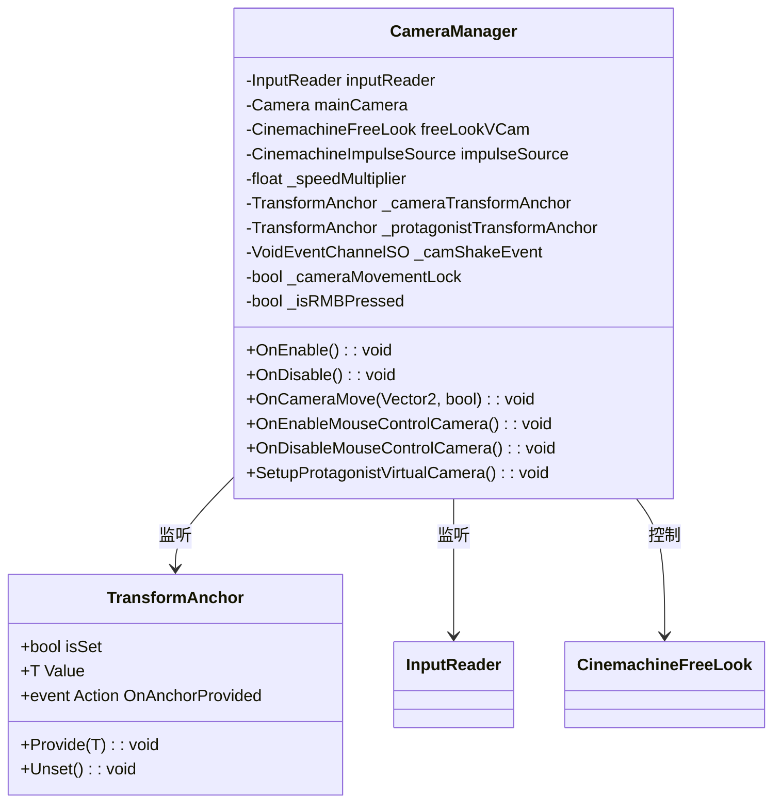
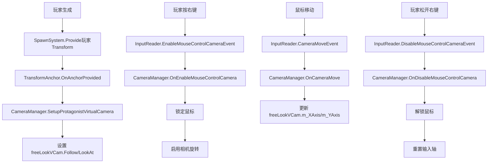

# Camera 模块解析

## 契约定义

### 核心类清单表

| 文件 | 角色 | 可见性 |
|------|------|--------|
| `CameraManager` | 相机管理器（Cinemachine + 输入） | `public class` |

### 关键设计约束

1. **Cinemachine集成**：使用 `CinemachineFreeLook` 控制相机
2. **输入处理**：监听 `InputReader.CameraMoveEvent`、`EnableMouseControlCameraEvent`
3. **锚点系统**：通过 `TransformAnchor` 获取玩家和相机引用
4. **鼠标控制**：右键按下时锁定鼠标，启用相机旋转
5. **震动效果**：监听 `_camShakeEvent` 触发 `CinemachineImpulseSource`

### Mermaid classDiagram

---

## 生命周期与内存

### 动词语义表

| 操作 | 做什么 | 内存分配 |
|------|--------|----------|
| `OnEnable()` | 订阅输入事件、锚点事件 | ❌ |
| `OnDisable()` | 取消订阅 | ❌ |
| `OnCameraMove()` | 更新 Cinemachine 输入轴 | ❌ |
| `OnEnableMouseControlCamera()` | 锁定鼠标，启用相机控制 | ❌ |
| `OnDisableMouseControlCamera()` | 解锁鼠标，重置输入轴 | ❌ |
| `SetupProtagonistVirtualCamera()` | 设置跟随目标 | ❌ |

### 相机控制流程

---

## 跨层桥接

### 核心层与上层对接

1. **锚点桥接**：`TransformAnchor` 传递玩家 Transform
2. **输入桥接**：`InputReader` 传递鼠标/手柄输入
3. **震动桥接**：`VoidEventChannelSO` 触发相机震动

---

## 落地难点

### 难点1：鼠标控制状态管理

**问题**：右键按下/松开需要正确管理鼠标锁定和输入轴。

**解决方案**：
- 按下：锁定鼠标，`_cameraMovementLock` 防止首帧抖动
- 松开：解锁鼠标，重置输入轴为 0

### 难点2：玩家引用延迟获取

**问题**：相机管理器可能在玩家生成前初始化。

**解决方案**：监听 `_protagonistTransformAnchor.OnAnchorProvided`，玩家生成时自动设置。

### 难点3：输入设备差异

**问题**：鼠标和手柄的输入处理不同（鼠标不需要乘以 deltaTime）。

**解决方案**：`OnCameraMove(Vector2, bool isDeviceMouse)` 区分设备。

---

## 坐标

- **模块优先级**：P1（组合层，依赖 RuntimeAnchors/Input）
- **依赖**：RuntimeAnchors、Input、Cinemachine
- **被依赖**：无（顶层）