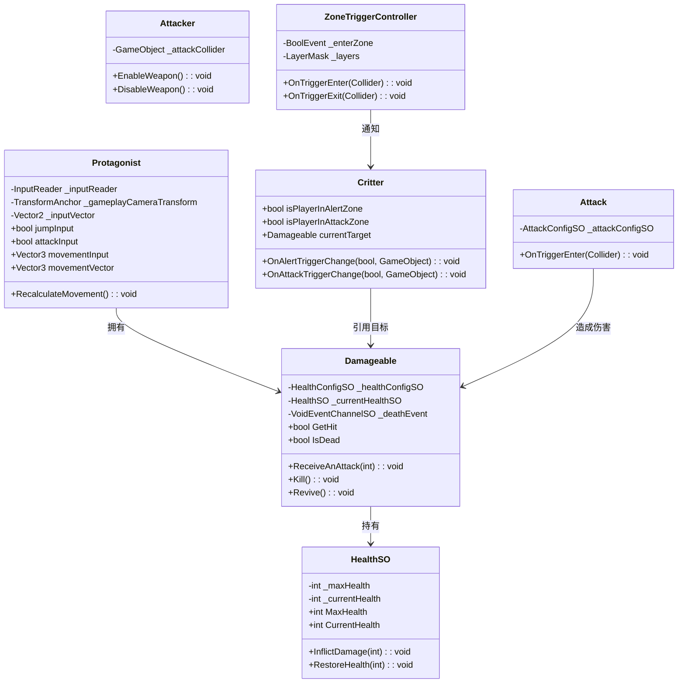
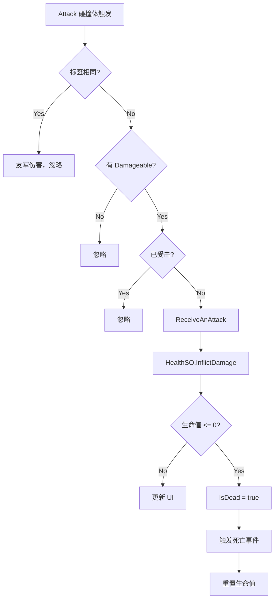
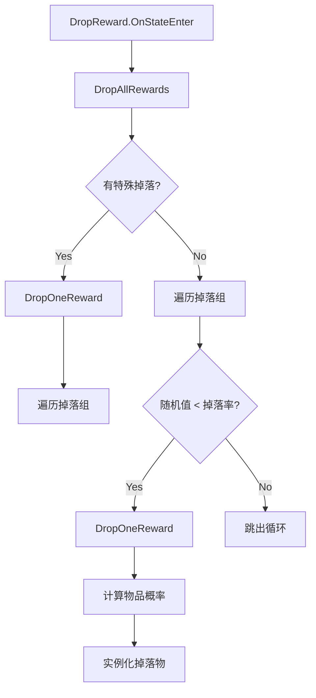

# Characters 模块解析

## 契约定义

### 核心类清单表

| 文件 | 角色 | 可见性 |
|------|------|--------|
| `Protagonist` | 玩家角色（输入消费 + 移动计算） | `public class` |
| `NPC` | 非玩家角色（状态切换） | `public class` |
| `Critter` | 可战斗生物（区域检测 + 目标追踪） | `public class` |
| `Damageable` | 可受伤组件（生命值 + 死亡） | `public class` |
| `HealthSO` | 生命值数据（SO 存储） | `public class` |
| `Attack` | 攻击碰撞体（触发伤害） | `public class` |
| `Attacker` | 攻击控制器（启用/禁用武器） | `public class` |
| `NPCMovement` | NPC 移动配置（事件驱动） | `public class` |
| `DropGroup` / `DropItem` | 掉落配置 | `public class` / `struct` |
| `MovingCritterAttackController` | 移动生物攻击（冲撞） | `public class` |
| `ZoneTriggerController` | 通用区域触发器 | `public class` |

### StateMachine Actions（部分）

| 文件 | 角色 |
|------|------|
| `ChangeGameStateActionSO` | 切换游戏状态 |
| `DestroyEntitySO` | 销毁实体 |
| `DropRewardSO` | 掉落奖励 |
| `ChasingTargetActionSO` | 追逐目标 |
| `ApplyMovementVectorActionSO` | 应用移动向量 |
| `HorizontalMoveActionSO` | 水平移动 |
| `GroundGravityActionSO` | 地面重力 |
| `AerialMovementActionSO` | 空中移动 |

### StateMachine Conditions（部分）

| 文件 | 角色 |
|------|------|
| `IsDeadConditionSO` | 是否死亡 |
| `IsInSpecificGameStateSO` | 是否在特定游戏状态 |
| `PlayerIsInZoneSO` | 玩家是否在区域 |
| `IsCharacterControllerGroundedConditionSO` | 是否着地 |
| `IsMovingConditionSO` | 是否在移动 |
| `TimeElapsedConditionSO` | 时间是否到达 |

### 关键设计约束

1. **组件分离**：`Damageable`（受伤）、`Attack`（攻击）、`Attacker`（武器控制）分离
2. **SO 存储生命值**：`HealthSO` 作为数据容器，支持实例化（敌人）和引用（玩家）
3. **输入与移动分离**：`Protagonist` 消费输入并计算移动向量，StateMachine Actions 执行移动
4. **区域触发器通用化**：`ZoneTriggerController` 使用 `LayerMask` 和 `UnityEvent<bool, GameObject>`
5. **掉落配置化**：`DropGroup` + `DropItem` 支持多组掉落 + 概率

### Mermaid classDiagram



---

## 生命周期与内存

### 动词语义表

| 操作 | 做什么 | 内存分配 |
|------|--------|----------|
| `Protagonist.RecalculateMovement()` | 根据输入和相机方向计算移动向量 | ❌ |
| `Damageable.ReceiveAnAttack()` | 扣血，触发死亡 | ❌ |
| `Damageable.Awake()` | 如果没有 HealthSO，创建新实例 | ✅ 可能 |
| `Critter.OnAlertTriggerChange()` | 更新警戒状态，设置目标 | ❌ |
| `Attack.OnTriggerEnter()` | 对目标造成伤害 | ❌ |
| `DropReward.OnStateEnter()` | 计算并生成掉落 | ✅ 掉落物实例 |

### 伤害流程



### 掉落流程



---

## 跨层桥接

### 核心层与上层对接

1. **输入桥接**：`Protagonist` 订阅 `InputReader` 事件，将输入转化为状态
2. **状态机桥接**：`Damageable.IsDead` / `GetHit` 被 StateMachine Conditions 读取
3. **事件桥接**：`Damageable` 通过 `VoidEventChannelSO` 广播死亡事件
4. **区域桥接**：`ZoneTriggerController` 通过 `UnityEvent<bool, GameObject>` 通知 `Critter`

### 跨层 DTO 快照

- `HealthSO`：生命值数据，被 StateMachine 读取
- `AttackConfigSO`：攻击配置（攻击力等）
- `DroppableRewardConfigSO`：掉落配置

---

## 落地难点

### 难点1：HealthSO 的实例化策略

**问题**：玩家有预设的 HealthSO，敌人需要在运行时创建。

**解决方案**：
```csharp
if (_currentHealthSO == null)
{
    _currentHealthSO = ScriptableObject.CreateInstance<HealthSO>();
    _currentHealthSO.SetMaxHealth(_healthConfigSO.InitialHealth);
}
```

**仿写陷阱**：如果忘记在 `Awake()` 中创建，敌人会空引用。

### 难点2：攻击的友军伤害检查

**问题**：避免同标签的实体互相伤害。

**解决方案**：`Attack.OnTriggerEnter()` 中检查 `other.CompareTag(gameObject.tag)`。

**仿写陷阱**：如果标签设置错误，可能导致无法攻击敌人或友军互伤。

### 难点3：掉落概率计算

**问题**：多组掉落，每组有概率，组内物品也有概率。

**解决方案**：
1. 先检查特殊掉落
2. 遍历掉落组，随机值 < 掉落率则掉落
3. 组内累加概率选择物品

**仿写陷阱**：如果概率计算错误，可能导致掉落不平衡。

---

## 坐标

- **模块优先级**：P2（业务层，依赖 StateMachine/Events/Gameplay）
- **依赖**：StateMachine、Events、Gameplay、Input
- **被依赖**：UI（间接）、SaveSystem（间接）
