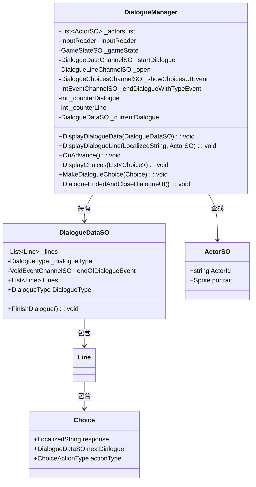
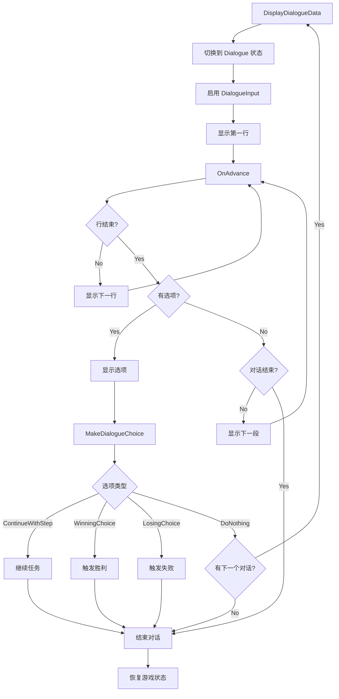

# Dialogues 模块解析

## 契约定义

### 核心类清单表

| 文件 | 角色 | 可见性 |
|------|------|--------|
| `DialogueManager` | 对话管理器（UI控制 + 流程） | `public class` |
| `DialogueDataSO` | 对话数据（行 + 选项） | `public class` |
| `DialogueTrigger` | 对话触发器 | `public class` |
| `ActorSO` | 角色定义 | `public class` |

### 关键设计约束

1. **逐行显示**：对话按行显示，玩家按按钮推进
2. **选项系统**：对话可以包含选项，影响任务/对话流程
3. **状态切换**：对话开始时切换到 `GameState.Dialogue`
4. **输入模式**：对话时启用 `DialogueInput`
5. **多结束类型**：对话可以有不同的结束类型（`DialogueType`）

### Mermaid classDiagram

---

## 生命周期与内存

### 动词语义表

| 操作 | 做什么 | 内存分配 |
|------|--------|----------|
| `DisplayDialogueData()` | 初始化对话，切换到Dialogue状态 | ❌ |
| `DisplayDialogueLine()` | 显示一行对话 | ❌ |
| `OnAdvance()` | 推进到下一行/选项/结束 | ❌ |
| `DisplayChoices()` | 显示选项，暂停推进 | ❌ |
| `MakeDialogueChoice()` | 处理选项，继续对话 | ❌ |
| `DialogueEndedAndCloseDialogueUI()` | 结束对话，恢复状态 | ❌ |

### 对话流程

---

## 跨层桥接

### 核心层与上层对接

1. **UI桥接**：通过 `DialogueLineChannelSO` 通知UI显示对话
2. **任务桥接**：选项可以触发任务推进（`ContinueWithStep`）
3. **状态桥接**：对话开始时切换到 `GameState.Dialogue`

---

## 落地难点

### 难点1：对话推进逻辑

**问题**：需要处理行、段、选项三层结构。

**解决方案**：使用 `_counterDialogue`（段索引）和 `_counterLine`（行索引）。

### 难点2：选项处理

**问题**：选项会暂停对话推进，需要特殊处理。

**解决方案**：显示选项时取消 `AdvanceDialogueEvent` 订阅，选择后重新订阅。

### 难点3：对话结束类型

**问题**：对话可以有不同的结束类型，影响后续逻辑。

**解决方案**：`DialogueType` 枚举 + `IntEventChannelSO` 广播结束类型。

---

## 坐标

- **模块优先级**：P2（业务层，依赖 Events/Gameplay）
- **依赖**：Events、Gameplay、Input
- **被依赖**：Quests、UI
