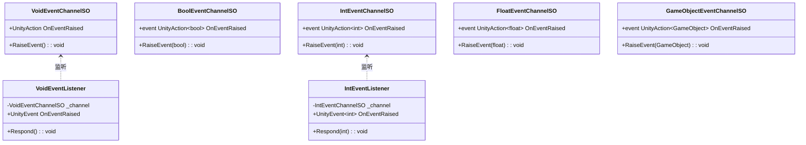
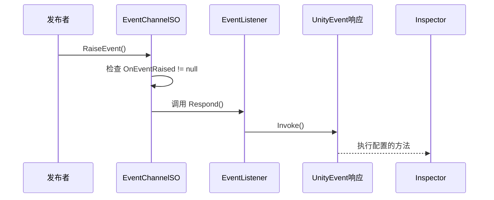
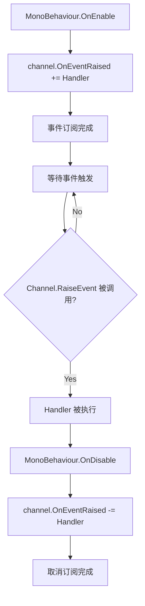

# Events 模块解析

## 契约定义

### 核心类清单表

| 文件 | 角色 | 可见性 |
|------|------|--------|
| `VoidEventChannelSO` | 无参数事件通道 | `public class` |
| `BoolEventChannelSO` | bool参数事件通道 | `public class` |
| `IntEventChannelSO` | int参数事件通道 | `public class` |
| `FloatEventChannelSO` | float参数事件通道 | `public class` |
| `GameObjectEventChannelSO` | GameObject参数事件通道 | `public class` |
| `TransformEventChannelSO` | Transform参数事件通道 | `public class` |
| `ItemEventChannelSO` | ItemSO参数事件通道 | `public class` |
| `ItemStackEventChannelSO` | ItemStack参数事件通道 | `public class` |
| `AudioCueEventChannelSO` | 音频事件通道（含Play/Stop/Finish） | `public class` |
| `DialogueDataChannelSO` | 对话数据事件通道 | `public class` |
| `DialogueLineChannelSO` | 对话行事件通道 | `public class` |
| `DialogueChoicesChannelSO` | 对话选项事件通道 | `public class` |
| `DialogueActorChannelSO` | 对话角色事件通道 | `public class` |
| `LoadEventChannelSO` | 场景加载请求通道 | `public class` |
| `VoidEventListener` | MonoBehaviour响应器（Inspector配置） | `public class` |
| `IntEventListener` | int参数响应器 | `public class` |

### 关键设计约束

1. **SO作为事件中心**：所有事件通道都是 `ScriptableObject`，可以在 Inspector 中配置，实现跨场景、跨预制体的解耦通信。
2. **发布-订阅模式**：`RaiseEvent()` 是发布，`OnEventRaised += Handler` 是订阅。
3. **MonoBehaviour 桥接**：`VoidEventListener` / `IntEventListener` 将 SO 事件桥接到 UnityEvent，允许在 Inspector 中配置响应。
4. **类型安全**：每种参数类型有独立的 Channel SO，编译期保证类型安全。
5. **空检查**：`RaiseEvent()` 内部检查 `OnEventRaised != null`，避免无订阅者时异常。

### Mermaid classDiagram

---

## 生命周期与内存

### 动词语义表

| 操作 | 做什么 | 内存分配 |
|------|--------|----------|
| `RaiseEvent()` | 调用所有订阅的委托 | ❌ 无分配（委托链已存在） |
| `OnEventRaised += Handler` | 添加订阅 | ❌ 委托合并（内部可能分配） |
| `OnEventRaised -= Handler` | 移除订阅 | ❌ 委托移除 |
| `VoidEventListener.OnEnable` | 订阅通道事件 | ❌ |
| `VoidEventListener.OnDisable` | 取消订阅 | ❌ |

### 事件流转图

### 订阅/取消订阅流程

---

## 跨层桥接

### 核心层与上层对接

1. **SO配置层**：所有 Channel 都是 `ScriptableObject`，在 Project 窗口创建并配置引用。
2. **发布端**：任何 MonoBehaviour 或 SO 都可以调用 `RaiseEvent()`。
3. **订阅端**：
   - 代码订阅：`channel.OnEventRaised += Handler`（在 `OnEnable`/`OnDisable` 中管理）
   - Inspector 订阅：通过 `VoidEventListener` 桥接到 `UnityEvent`

### 跨层 DTO 快照

- `ItemEventChannelSO`：传递 `ItemSO` 引用（物品数据）
- `ItemStackEventChannelSO`：传递 `ItemStack` 结构体（物品 + 数量）
- `DialogueDataChannelSO`：传递 `DialogueDataSO` 引用（对话数据）
- `LoadEventChannelSO`：传递 `GameSceneSO` + 加载参数

---

## 落地难点

### 难点1：订阅生命周期管理

**问题**：如果 `OnDisable` 中忘记取消订阅，会导致委托持有已销毁对象的引用，引发内存泄漏或空引用异常。

**解决方案**：严格在 `OnEnable` 订阅、`OnDisable` 取消订阅。

**仿写陷阱**：如果使用匿名方法订阅，无法取消订阅（除非保存委托引用）。

### 难点2：事件顺序依赖

**问题**：多个监听者订阅同一事件，执行顺序是添加顺序。如果业务逻辑依赖特定顺序，可能出错。

**解决方案**：Unity 的 UnityAction 按添加顺序执行。如需控制顺序，使用中间协调器或优先级系统。

### 难点3：跨场景事件

**问题**：SO 事件通道是场景无关的，但 MonoBehaviour 订阅者可能在场景切换时销毁。

**解决方案**：使用 DontDestroyOnLoad 的 Manager 对象，或在 `OnDisable` 中正确取消订阅。

---

## 坐标

- **模块优先级**：P0（底座，几乎所有模块都依赖）
- **依赖**：``DescriptionBaseSO`）
- **被依赖**：Gameplay、Characters、Inventory、SaveSystem、SceneManagement、Quests、Dialogues、Audio、UI、Interaction、Camera
