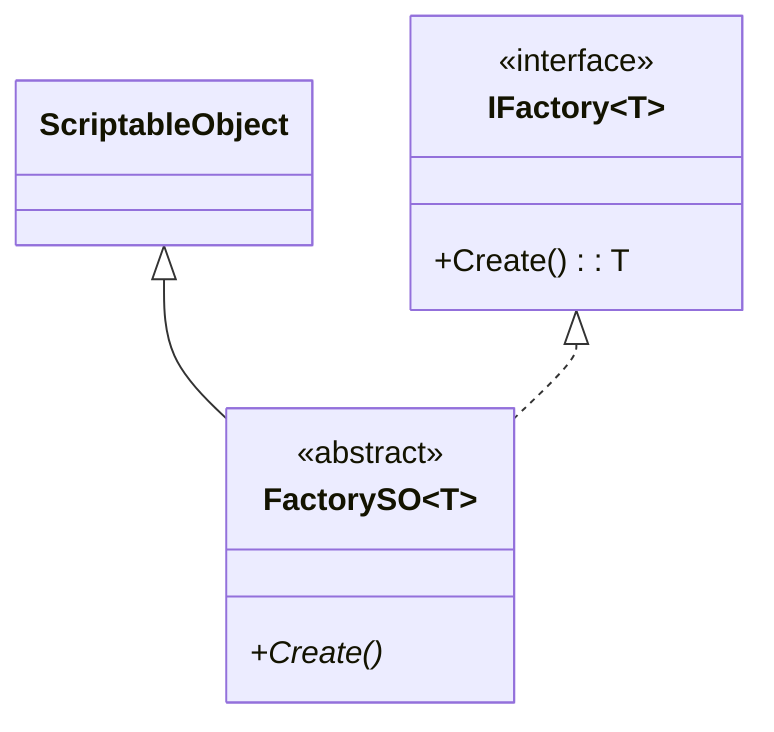

# Factory 模块解析

## 契约定义

### 核心接口/类清单表

| 文件 | 角色 | 可见性 |
|------|------|--------|
| `IFactory<T>` | 工厂契约（Create方法） | `public interface` |
| `FactorySO<T>` | 抽象基类（SO + IFactory） | `public abstract class` |

### 关键设计约束

1. **泛型接口**：`IFactory<T>` 支持任意类型的创建
2. **SO 基类**：`FactorySO<T>` 继承 `ScriptableObject`，允许在 Inspector 中配置
3. **抽象 Create**：子类必须实现具体的创建逻辑

### Mermaid classDiagram



---

## 生命周期与内存

### 动词语义表

| 操作 | 做什么 | 内存分配 |
|------|--------|----------|
| `FactorySO<T>.Create()` | 子类实现具体创建逻辑 | ✅ 取决于实现（new / Instantiate） |

---

## 跨层桥接

### 注入点

`IFactory<T>` 作为 `PoolSO<T>` 的依赖注入点：
```csharp
public abstract IFactory<T> Factory { get; set; }
```

---

## 落地难点

### 难点：工厂与池的配合

工厂负责创建新对象，池负责复用。池通过 `Factory.Create()` 创建对象，通过 `Return()` 回收。

---

## 坐标

- **模块优先级**：P0（底座，被 Pool 依赖）
- **依赖**：无
- **被依赖**：Pool
