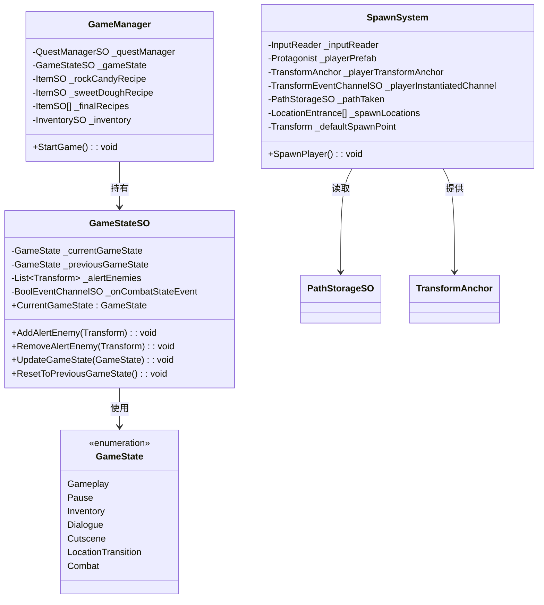
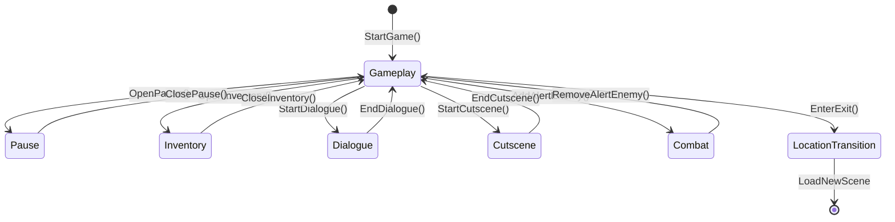

# Gameplay 模块解析

## 契约定义

### 核心类清单表

| 文件 | 角色 | 可见性 |
|------|------|--------|
| `GameState` | 游戏状态枚举 | `public enum` |
| `GameStateSO` | 游戏状态管理（状态机 + 战斗追踪） | `public class` |
| `GameManager` | 游戏启动 + 配方管理 | `public class` |
| `SpawnSystem` | 玩家生成 + 场景入口选择 | `public class` |

### 关键设计约束

1. **状态枚举驱动**：`GameState` 定义所有可能的游戏状态（Gameplay/Pause/Inventory/Dialogue/Cutscene/LocationTransition/Combat）
2. **状态切换广播**：`GameStateSO.UpdateGameState()` 在状态变化时更新前一个状态，并广播战斗状态事件
3. **战斗状态特殊处理**：Combat 状态通过 `AddAlertEnemy`/`RemoveAlertEnemy` 管理敌人列表
4. **状态回退**：`ResetToPreviousGameState()` 支持状态栈式回退
5. **生成点选择**：`SpawnSystem` 根据 `PathStorageSO.lastPathTaken` 选择正确的入口

### Mermaid classDiagram



---

## 生命周期与内存

### 动词语义表

| 操作 | 做什么 | 内存分配 |
|------|--------|----------|
| `GameStateSO.UpdateGameState()` | 更新状态，广播战斗事件 | ❌ |
| `GameStateSO.AddAlertEnemy()` | 添加敌人到列表，切换到 Combat | ❌ |
| `GameStateSO.RemoveAlertEnemy()` | 从回到 Gameplay | ❌ |
| `GameStateSO.ResetToPreviousGameState()` | 交换当前/前一状态 | ❌ |
| `SpawnSystem.SpawnPlayer()` | 实例化玩家，设置锚点，启用输入 | ✅ 玩家实例 |
| `GameManager.StartGame()` | 初始化状态，启动任务 | ❌ |

### 游戏状态流转图



### 战斗状态管理流程

```mermaid
flowchart TD
    A[敌人发现玩家] --> B[GameStateSO.AddAlertEnemy]
    B --> C{敌人已存在?}
    C -->|Yes| D[忽略]
    C -->|No| E[添加到 _alertEnemies]
    E --> F[切换到 Combat 状态]
    F --> G[广播 _onCombatStateEvent(true)]
    
    H[敌人丢失玩家] --> I[GameStateSO.RemoveAlertEnemy]
    I --> J{列表为空?}
    J -->|No| K[保持 Combat]
    J -->|Yes| L[切换到 Gameplay]
    L --> M[广播 _onCombatStateEvent(false)]
```

---

## 跨层桥接

### 核心层与上层对接

1. **GameStateSO**：被 StateMachine Conditions（如 `IsInSpecificGameStateCondition`）读取，驱动状态转换
2. **SpawnSystem**：通过 `TransformAnchor` 将玩家引用传递给 CameraSystem
3. **GameManager**：通过事件监听配方添加，与 Inventory 系统交互

### 跨层 DTO 快照

- `GameState` 枚举：被多个系统读取（InputReader、DialogueManager、StateMachine Conditions）
- `TransformAnchor`：传递玩家 Transform 给相机系统
- `PathStorageSO`：传递路径信息给出生点选择

---

## 落地难点

### 难点1：状态回退逻辑

**问题**：`ResetToPreviousGameState()` 需要正确处理 Combat 状态的进入/退出事件。

**解决方案**：
- 如果前一状态是 Combat，广播 `false`（退出战斗）
- 如果当前状态是 Combat，广播 `true`（进入战斗）

**仿写陷阱**：如果忘记广播事件，UI 不会更新战斗指示器。

### 难点2：战斗状态的多敌人管理

**问题**：多个敌人可能同时发现/丢失玩家，需要正确处理引用计数。

**解决方案**：使用 `List<Transform>` 追踪所有警戒敌人，只有列表为空时才退出 Combat。

**仿写陷阱**：如果同一个敌人被添加两次，会导致计数错误。

### 难点3：生成点选择

**问题**：需要根据玩家上次选择的路径选择正确的入口。

**解决方案**：
1. `LocationExit` 在触发时设置 `PathStorageSO.lastPathTaken`
2. `SpawnSystem` 在 `GetSpawnLocation()` 中查找匹配的 `LocationEntrance`

**仿写陷阱**：如果路径不匹配，回退到默认出生点。

---

## 坐标

- **模块优先级**：P1（组合层，依赖 Events/StateMachine/RuntimeAnchors）
- **依赖**：Events、StateMachine（间接）、RuntimeAnchors
- **被依赖**：Characters、Dialogues、UI、Input
