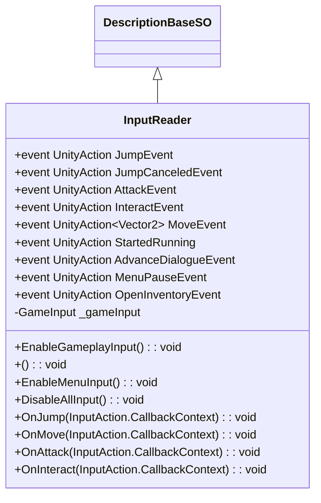
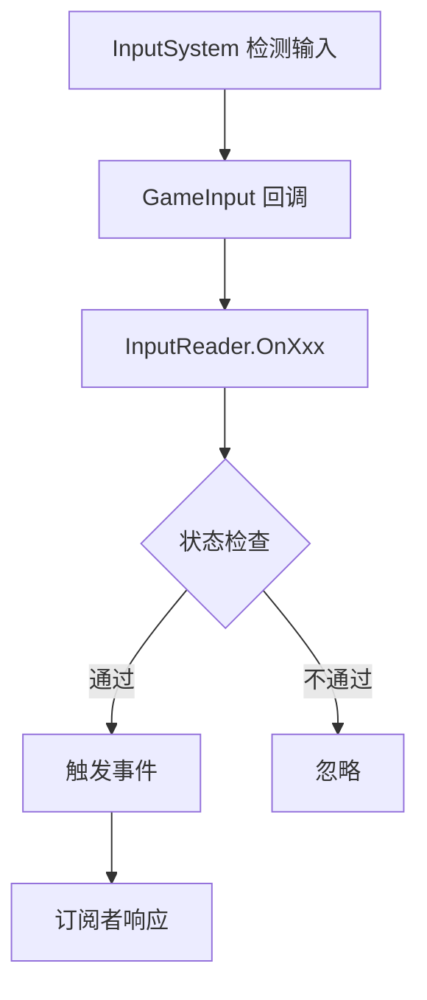

# Input 模块解析

## 契约定义

### 核心类清单表

| 文件 | 角色 | 可见性 |
|------|------|--------|
| `InputReader` | 输入读取器（SO + 事件） | `public class` |
| `GameInput` | 生成的InputAction代码（auto-generated） | `public class` |

### 关键设计约束

1. **SO存储事件**：`InputReader` 继承 `DescriptionBaseSO`，事件在SO中定义
2. **多Action Map**：Gameplay、Dialogues、Menus、Cheats 四个动作映射
3. **状态过滤**：`OnInteract()` 检查 `GameState.Gameplay`
4. **事件广播**：输入动作触发C#事件，其他系统订阅
5. **输入模式切换**：`EnableGameplayInput()`、`EnableDialogueInput()` 等

### Mermaid classDiagram

---

## 生命周期与内存

### 动词语义表

| 操作 | 做什么 | 内存分配 |
|------|--------|----------|
| `OnEnable()` | 创建 `GameInput`，绑定回调 | ✅ 首次创建 |
| `OnDisable()` | 禁用所有输入 | ❌ |
| `OnJump()` | 触发 `JumpEvent` | ❌ |
| `OnMove()` | 触发 `MoveEvent` | ❌ |
| `EnableGameplayInput()` | 启用 Gameplay Action Map | ❌ |
| `EnableDialogueInput()` | 启用 Dialogues Action Map | ❌ |

### 输入处理流程

---

## 跨层桥接

### 核心层与上层对接

1. **Gameplay输入**：`Protagonist` 订阅 `JumpEvent`、`MoveEvent` 等
2. **Dialogue输入**：`DialogueManager` 订阅 `AdvanceDialogueEvent`
3. **Menu输入**：`UIManager` 订阅 `MenuPauseEvent`、`OpenInventoryEvent`

---

## 落地难点

### 难点1：输入模式切换

**问题**：不同游戏状态需要不同的输入响应。

**解决方案**：启用/禁用不同的 Action Map。

### 难点2：状态过滤

**问题**只在特定状态下有效。

**解决方案**：在回调中检查 `GameStateSO.CurrentGameState`。

---

## 坐标

- **模块优先级**：P0（底座）
- **依赖**：无
- **被依赖**：Characters、Dialogues、UI、Interaction、Camera
