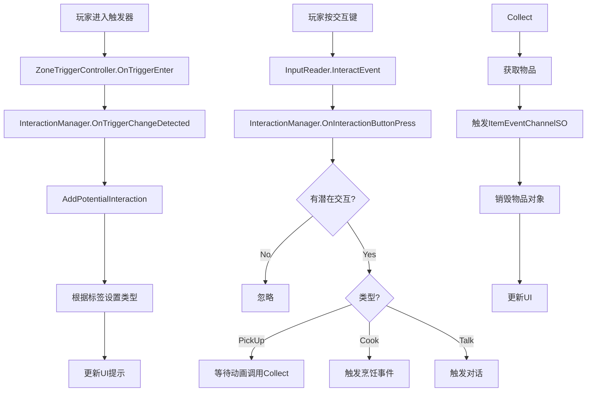

# Interaction 模块解析

## 契约定义

### 核心类清单表

| 文件 | 角色 | 可见性 |
|------|------|--------|
| `InteractionManager` | 交互管理器（LinkedList优先级） | `public class` |
| `Interaction` | 交互数据（类型 + 对象） | `public class` |

### 关键设计约束

1. **LinkedList存储**：`_potentialInteractions` 使用 `LinkedList<Interaction>` 管理潜在交互
2. **优先级排序**：第一个元素是最高优先级的交互
3. **类型区分**：`InteractionType`（None/PickUp/Cook/Talk）
4. **事件驱动**：通过 `InputReader.InteractEvent` 触发交互
5. **UI通知**：通过 `InteractionUIEventChannelSO` 通知UI显示提示

### Mermaidmermaid
classDiagram
    class InteractionManager {
        -InputReader _inputReader
        -ItemEventChannelSO _onObjectPickUp
        -VoidEventChannelSO _onCookingStart
        -DialogueActorChannelSO _startTalking
        -InteractionUIEventChannelSO _toggleInteractionUI
        -VoidEventChannelSO _onInteractionEnded
        -PlayableDirectorChannelSO _onCutsceneStart
        -InteractionType currentInteractionType
        -LinkedList~Interaction~ _potentialInteractions
        +OnInteractionButtonPress() : void
        +OnInteractionEnd() : void
        +Collect() : void
        +OnTriggerChangeDetected(bool, GameObject) : void
        +AddPotentialInteraction(GameObject) : void
        +RemovePotentialInteraction(GameObject) : void
        +RequestUpdateUI(bool) : void
    }
    
    class Interaction {
        +InteractionType type
        +GameObject interactableObject
        +Interaction(InteractionType, GameObject)
    }
    
    class InteractionType {
        <<enumeration>>
        None
        PickUp
        Cook
        Talk
    }
    
    InteractionManager --> Interaction : 包含
    InteractionManager --> InputReader : 监听
```

---

## 生命周期与内存

### 动词语义表

| 操作 | 做什么 | 内存分配 |
|------|--------|----------|
| `OnInteractionButtonPress()` | 执行第一个交互 | ❌ |
| `AddPotentialInteraction()` | 添加到链表 | ✅ LinkedListNode |
| `RemovePotentialInteraction()` | 从链表移除 | ❌ |
| `Collect()` | 拾取物品，销毁对象 | ❌ |
| `OnTriggerChangeDetected()` | 触发器回调，添加/移除交互 | ❌ |

### 交互流程



---

## 跨层桥接

### 核心层与上层对接

1. **输入桥接**：`InputReader.InteractEvent` 触发交互
2. **事件桥接**：`ItemEventChannelSO` 通知拾取，`DialogueActorChannelSO` 通知对话
3. **UI桥接**：`InteractionUIEventChannelSO` 显示/隐藏提示

---

## 落地难点

### 难点1：优先级管理

**问题**：多个交互对象同时存在时，需要选择最近的/最优先的。

**解决方案**：使用 `LinkedList<Interaction>`，第一个元素是最高优先级。

### 难点2：交互类型区分

**问题**：不同交互对象（可拾取、可对话、可烹饪）需要不同处理。

**解决方案**：通过标签（`CompareTag`）区分类型。

### 难点3：动画与交互同步

**问题**：拾取动画播放期间需要禁用交互。

**解决方案**：动画事件中调用 `Collect()`，交互结束后触发 `OnInteractionEnded`。

---

## 坐标

- **模块优先级**：P2（业务层，依赖 Events/Input）
- **依赖**：Events、Input
- **被依赖**：Characters、UI
