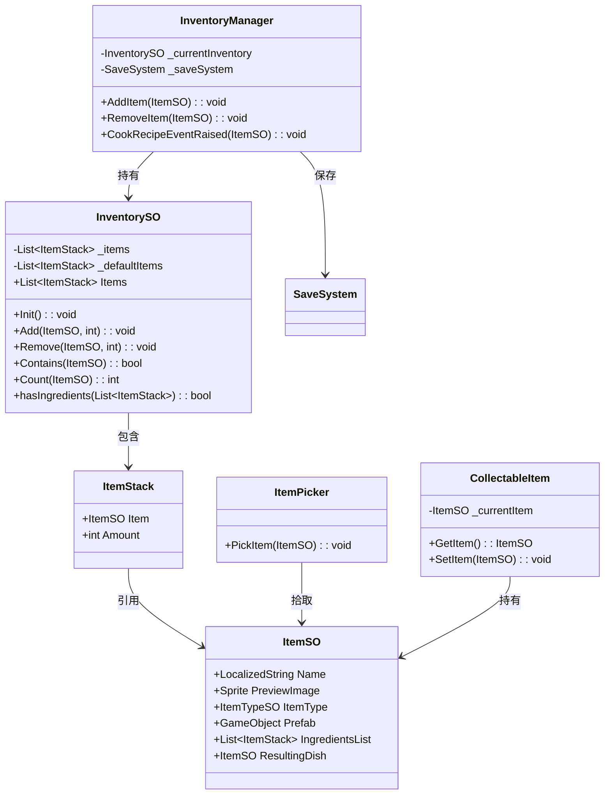
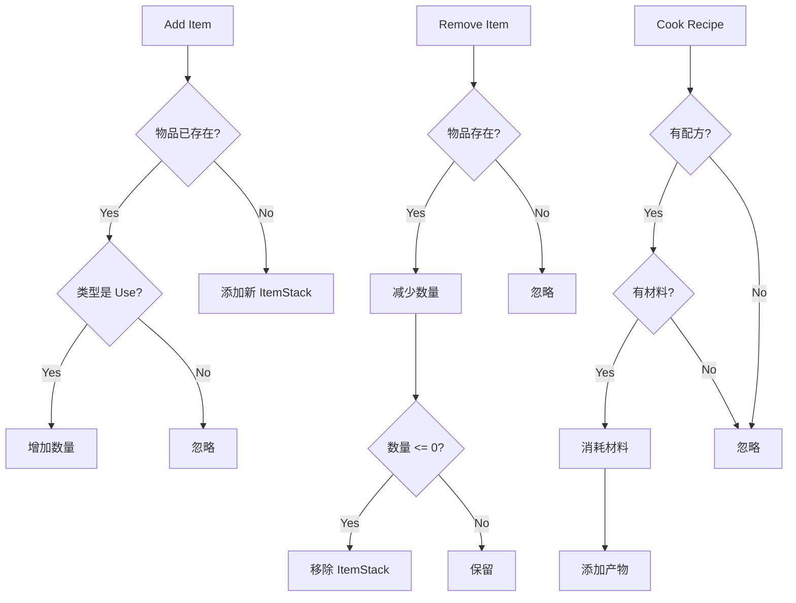

# Inventory 模块解析

## 契约定义

### 核心类清单表

| 文件 | 角色 | 可见性 |
|------|------|--------|
| `InventorySO` | 背包数据（物品列表 + 操作） | `public class` |
| `ItemSO` | 物品定义（继承 SerializableScriptableObject） | `public class` |
| `ItemStack` | 物品堆叠（物品 + 数量） | `public struct` |
| `ItemInstance` | 场景中的物品实例（MonoBehaviour） | `public class` |
| `ItemPicker` | 物品拾取器 | `public class` |
| `CollectableItem` | 可收集物品（动画 + 数据） | `public class` |
| `InventoryManager` | 背包管理器（事件驱动） | `public class` |
| `ItemRecipeSO` | 配方 SO | `public class` |
| `ItemTypeSO` | 物品类型 SO | `public class` |

### 关键设计约束

1. **ItemSO 继承 SerializableScriptableObject**：支持 Guid 序列化，用于存档
2. **ItemStack 结构体**：轻量包装（ItemSO + Amount），避免堆分配
3. **InventorySO 操作**：Add/Remove/Contains/Count/hasIngredients
4. **类型区分**：`ItemInventoryActionType.Use` 决定物品是否可堆叠
5. **事件驱动**：`InventoryManager` 监听多个事件（Cook/Use/Equip/Reward/Give/Add/Remove）

### Mermaid classDiagram

---

## 生命周期与内存

### 动词语义表

| 操作 | 做什么 | 内存分配 |
|------|--------|----------|
| `InventorySO.Init()` | 从默认物品初始化 | ✅ 复制 ItemStack |
| `InventorySO.Add()` | 添加物品或增加数量 | ❌ 或 ✅（新物品） |
| `InventorySO.Remove()` | 减少数量或移除 | ❌ |
| `InventorySO.hasIngredients()` | 检查配方材料 | ❌ |
| `InventoryManager.CookRecipeEventRaised()` | 烹饪配方 | ❌ |
| `ItemPicker.PickItem()` | 触发拾取事件 | ❌ |

### 背包操作流程

---

## 跨层桥接

### 核心层与上层对接

1. **存档桥接**：`InventoryManager` 在每次修改后调用 `_saveSystem.SaveDataToDisk()`
2. **事件桥接**：监听 `ItemEventChannelSO` / `ItemStackEventChannelSO`
3. **UI 桥接**：通过事件通知 UI 更新（间接）

### 跨层 DTO 快照

- `ItemSO`：物品定义，被多个系统引用
- `ItemStack`：物品 + 数量，用于背包操作
- `SerializedItemStack`：Guid + 数量，用于存档

---

## 落地难点

### 难点1：可堆叠 vs 不可堆叠物品

**问题**：某些物品（如武器）不应堆叠。

**解决方案**：检查 `ItemSO.ItemType.ActionType == ItemInventoryActionType.Use`。

**仿写陷阱**：如果忘记检查，武器会被堆叠。

### 难点2：配方材料检查

**问题**：需要检查背包中是否有足够的材料。

**解决方案**：`hasIngredients()` 遍历所有材料，检查数量和存在性。

**仿写陷阱**：如果只检查存在性不检查数量，可能导致材料不足时也能烹饪。

### 难点3：存档序列化

**问题**：ItemSO 引用不能直接序列化为 JSON。

**解决方案**：使用 `SerializedItemStack`（Guid + Amount），运行时通过 Addressables 加载。

**仿写陷阱**：如果 Guid 不正确，加载会失败。

---

## 坐标

- **模块优先级**：P1（组合层，依赖 Events/BaseClasses）
- **依赖**：Events、BaseClasses
- **被依赖**：SaveSystem、Quests、UI
