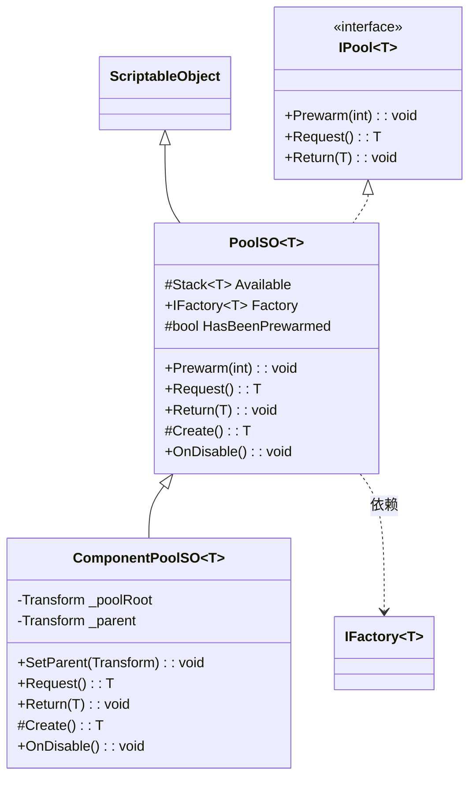
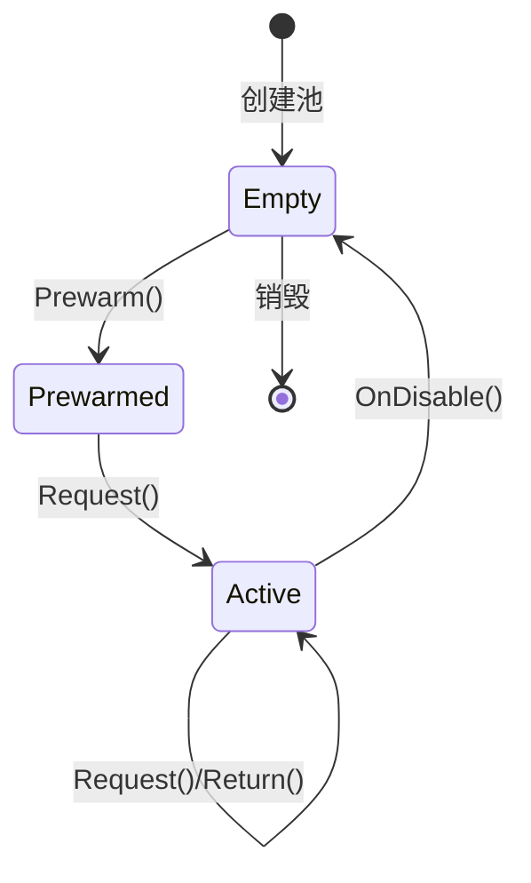
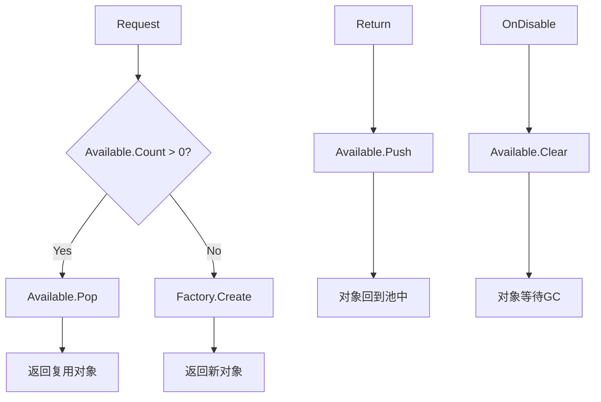

# Pool 模块解析

## 契约定义

### 核心接口/类清单表

| 文件 | 角色 | 可见性 |
|------|------|--------|
| `IPool<T>` | 池契约（Prewarm/Request/Return） | `public interface` |
| `PoolSO<T>` | 通用对象池（Stack + Factory） | `public abstract class` |
| `ComponentPoolSO<T>` | Component 专用池（GameObject管理） | `public abstract class` |

### 关键设计约束

1. **Stack 复用**：使用 `Stack<T>` 存储可用对象，LIFO 模式
2. **Factory 注入**：通过 `IFactory<T>.Create()` 创建新对象
3. **Prewarm 一次性**：`HasBeenPrewarmed` 标志防止重复预热
4. **OnDisable 清理**：池禁用时清空所有可用对象
5. **Component 池父子关系**：创建的对象自动设置为池根的子物体

### Mermaid classDiagram

---

## 生命周期与内存

### 动词语义表

| 操作 | 做什么 | 内存分配 |
|------|--------|----------|
| `Prewarm(int)` | 预创建 N 个对象压入栈 | ✅ 分配 N 个对象 |
| `Request()` | 弹出栈顶或创建新对象 | ❌ 或 ✅（栈空时） |
| `Return(T)` | 对象压回栈 | ❌ |
| `OnDisable()` | 清空栈，重置标志 | ❌（GC 延迟回收） |
| `ComponentPoolSO.Create()` | 创建对象并设置父子关系 | ✅ |
| `ComponentPoolSO.Return(T)` | 禁用对象并归位池根 | ❌ |

### 池状态流转图

### 对象分配/复用流程

---

## 跨层桥接

### 核心层与上层对接

1. **SO 配置层**：`PoolSO<T>` 子类在 Project 窗口创建，配置 Factory 引用
2. **运行时层**：`Request()` / `Return()` 由使用者（如 AudioManager、SpawnSystem）调用
3. **注入点**：`IFactory<T> Factory` 属性，由子类或外部设置

### ComponentPoolSO 特殊处理

- 自动创建池根 GameObject
- 支持 `SetParent(Transform)` 设置父物体
- 禁用时自动销毁池根

---

## 落地难点

### 难点1：Prewarm 一次性约束

**问题**：如果 `Prewarm()` 被调用多次，会创建多余对象。

**解决方案**：`HasBeenPrewarmed` 标志 + `Debug.LogWarning`。

**仿写陷阱**：如果忘记在 `OnDisable()` 中重置标志，重新启用后无法再次预热。

### 难点2：Component 池的父子关系管理

**问题**：池中的 Component 需要归属到一个 GameObject 下，避免场景混乱。

**解决方案**：
- 创建 `new GameObject(name)` 作为池根
- `Create()` 时设置 `transform.SetParent(PoolRoot)`
- `Return()` 时重新归位

**仿写陷阱**：如果池根被销毁但未清空栈，后续 `Request()` 会返回无效引用。

### 难点3：Factory 依赖注入

**问题**：池需要创建新对象，但创建逻辑不应硬编码在池中。

**解决方案**：`IFactory<T>` 接口 + 抽象属性。

**仿写陷阱**：如果子类未正确设置 `Factory`，运行时会 NullReferenceException。

---

## 坐标

- **模块优先级**：P0（底座，被 Audio 依赖）
- **依赖**：Factory
- **被依赖**：Audio（SoundEmitterPoolSO）
