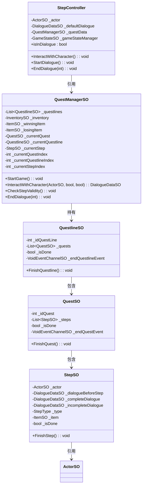
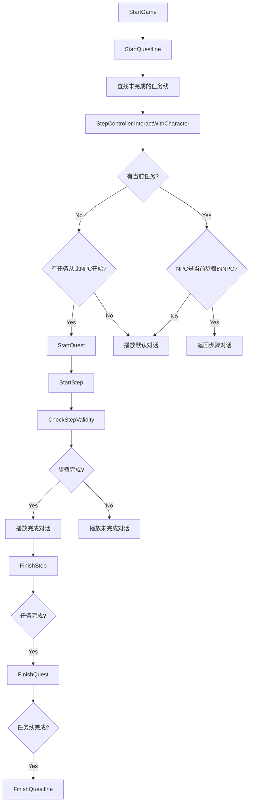

# Quests 模块解析

## 契约定义

### 核心类清单表

| 文件 | 角色 | 可见性 |
|------|------|--------|
| `QuestManagerSO` | 任务管理器（状态机 + 进度追踪） | `public class` |
| `StepController` | 步骤控制器（MonoBehaviour，挂载在NPC上） | `public class` |
| `QuestlineSO` | 任务线数据 | `public class` |
| `QuestSO` | 任务数据 | `public class` |
| `StepSO` | 步骤数据 | `public class` |
| `ActorSO` | 角色定义 | `public class` |

### 关键设计约束

1. **层级结构**：Questline → Quest → Step
2. **状态追踪**：`QuestManagerSO` 维护当前任务线/任务/步骤索引
3. **对话驱动**：`StepController` 触发对话，根据对话结果推进任务
4. **物品检查**：步骤可以要求检查背包中是否有特定物品
5. **事件广播**：任务/步骤完成时广播事件

### Mermaid classDiagram

---

## 生命周期与内存

### 动词语义表

| 操作 | 做什么 | 内存分配 |
|------|--------|----------|
| `QuestManagerSO.StartGame()` | 初始化，订阅事件，启动第一个任务线 | ❌ |
| `StepController.InteractWithCharacter()` | 检查任务状态，开始对话 | ❌ |
| `QuestManagerSO.CheckStepValidity()` | 检查步骤是否完成 | ❌ |
| `StepSO.FinishStep()` | 标记完成，广播事件 | QuestSO.FinishQuest()` | 标记完成，广播事件 | ❌ |
| `QuestlineSO.FinishQuestline()` | 标记完成，广播事件 | ❌ |

### 任务推进流程

---

## 跨层桥接

### 核心层与上层对接

1. **对话桥接**：`StepController` 通过 `DialogueDataChannelSO` 触发对话
2. **物品桥接**：`QuestManagerSO` 持有 `InventorySO` 引用，检查物品
3. **事件桥接**：任务/步骤完成时广播事件给其他系统

---

## 落地难点

### 难点1：任务状态机

**问题**：任务有多个层级（Questline → Quest → Step），需要正确追踪当前状态。

**解决方案**：`QuestManagerSO` 维护 `_currentQuestline`、`_currentQuest`、`_currentStep` 三个引用。

### 难点2：对话与任务进度的同步

**问题**：对话结束后需要根据结果推进任务。

**解决方案**：`StepController` 订阅对话结束事件，调用 `QuestManagerSO.CheckStepValidity()`。

### 难点3：物品检查

**问题**：步骤可能需要检查背包中是否有特定物品。

**解决方案**：`StepSO` 持有 `ItemSO` 引用，`CheckStepValidity()` 中检查 `InventorySO.Contains()`。

---

## 坐标

- **模块优先级**：P2（业务层，依赖 Events/Inventory）
- **依赖**：Events、Inventory、Dialogues
- **被依赖**：SaveSystem、Characters
