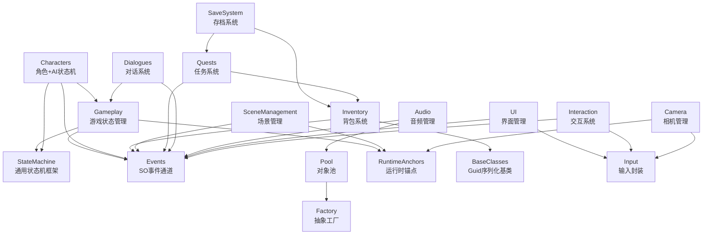

# ChopChop 架构反向工程解析文档

> 本项目是一个基于 Unity 的 3D 动作冒险游戏，采用 ScriptableObject 架构 + 事件驱动 + 状态机模式。

---

## 模块清单表

| 模块 | 目录 | 角色 | 依赖深度 | 状态 |
|------|------|------|----------|------|
| **StateMachine** | `Scripts/StateMachine/` | 通用状态机框架（SO配置驱动） | 0（底座） | � |
| **Events** | `Scripts/Events/` | SO-based 事件通道（解耦通信） | 0（底座） | ⬜ |
| **Factory** | `Scripts/Factory/` | 抽象工厂接口 | 0（底座） | ⬜ |
| **Pool** | `Scripts/Pool/` | 对象池（Stack + Factory注入） | 1（依赖Factory） | � |
| **RuntimeAnchors** | `Scripts/RuntimeAnchors/` | 运行时引用传递（SO存储） | 0（底座） | ⬜ |
| **BaseClasses** | `Scripts/BaseClasses/` | 基础SO类（Guid序列化） | 0（底座） | ⬜ |
| **Gameplay** | `Scripts/Gameplay/` | 游戏状态管理 + 生成系统 | 1（依赖Events/StateMachine） | � |
| **Characters** | `Scripts/Characters/` | 角色组件 + AI状态机实例 | 2（依赖StateMachine/Events） | ⬜ |
| **Inventory** | `Scripts/Inventory/` | 背包系统 | 1（依赖Events） | ⬜ |
| **SaveSystem** | `Scripts/SaveSystem/` | 存档系统（JSON + Addressables） | 1（依赖Inventory/Quests） | ⬜ |
| **SceneManagement** | `Scripts/SceneManagement/` | 场景加载/卸载 + 位置入口/出口 | 1（依赖Events） | ⬜ |
| **Quests** | `Scripts/Quests/` | 任务系统（Questline→Quest→Step） | 2（依赖Events/Inventory） | ⬜ |
| **Dialogues** | `Scripts/Dialogues/` | 对话系统 | 2（依赖Events/GameState） | ⬜ |
| **Input** | `Scripts/Input/` | 输入封装（InputSystem） | 0（底座） | ⬜ |
| **Audio** | `Scripts/Audio/` | 音频管理（对象池 + Event驱动） | 2（依赖Pool/Events） | � |
| **UI** | `Scripts/UI/` | UI管理器 | 2（依赖Events/Input） | � |
| **Interaction** | `Scripts/Interaction/` | 交互系统（LinkedList优先级） | 2（依赖Events/Input） | � |
| **Camera** | `Scripts/Camera/` | 相机管理（Cinemachine） | 1（依赖RuntimeAnchors） | � |

---

## 依赖关系图

---

## 解析进度

| # | 模块 | 01_解析 | 02_Facade | 03_考题 | 一句话 checkpoint |
|---|------|---------|-----------|---------|-------------------|
| 1 | StateMachine | ✅ | ✅ | ✅ | SO→实例1:1映射 + 条件缓存延迟清除 |
| 2 | Events | ✅ | ✅ | ✅ | SO事件中心 + 生命周期绑定订阅 |
| 3 | Factory | ✅ | ✅ | ✅ | 工厂注入池，解耦创建逻辑 |
| 4 | Pool | ✅ | ✅ | ✅ | Stack+Factory注入 + Component父子关系 |
| 5 | RuntimeAnchors | ✅ | ✅ | ✅ | SO存储运行时引用 + isSet状态标志 |
| 6 | BaseClasses | ✅ | ✅ | ✅ | Guid序列化支撑存档系统 |
| 7 | Gameplay | ✅ | ✅ | ✅ | 全局状态vs实体状态分离 + 战斗引用计数 |
| 8 | Characters | ✅ | ✅ | ✅ | HealthSO实例化策略 + 输入状态机分离 |
| 9 | Inventory | ✅ | ✅ | ✅ | 可堆叠检查 + 事件驱动修改 |
| 10 | SaveSystem | ✅ | ✅ | ✅ | Guid序列化+Addressables + 备份机制 |
| 11 | SceneManagement | ✅ | ✅ | ✅ | 加载状态锁 + 路径系统跨场景传递 |
| 12 | Quests | ✅ | ✅ | ✅ | 三级层级状态机 + 对话驱动推进 |
| 13 | Dialogues | ✅ | ✅ | ✅ | 逐行推进+选项暂停 + 状态切换 |
| 14 | Input | ✅ | ✅ | ✅ | SO存储事件 + 状态过滤 |
| 15 | Audio | ✅ | ✅ | ✅ | 控制键机制 + 对象池音频播放 |
| 16 | UI | ✅ | ✅ | ✅ | 事件驱动面板 + 时间缩放暂停 |
| 17 | Interaction | ✅ | ✅ | ✅ | LinkedList优先级 + 类型区分 |
| 18 | Camera | ✅ | ✅ | ✅ | 锚点驱动相机 + 输入设备差异处理 |

---

## 跨模块设计主线（完成后提炼）

> 全部模块解析完成后，在此处提炼反复出现的设计模式与架构母题。

---

*文档生成时间：2026-06-30*
