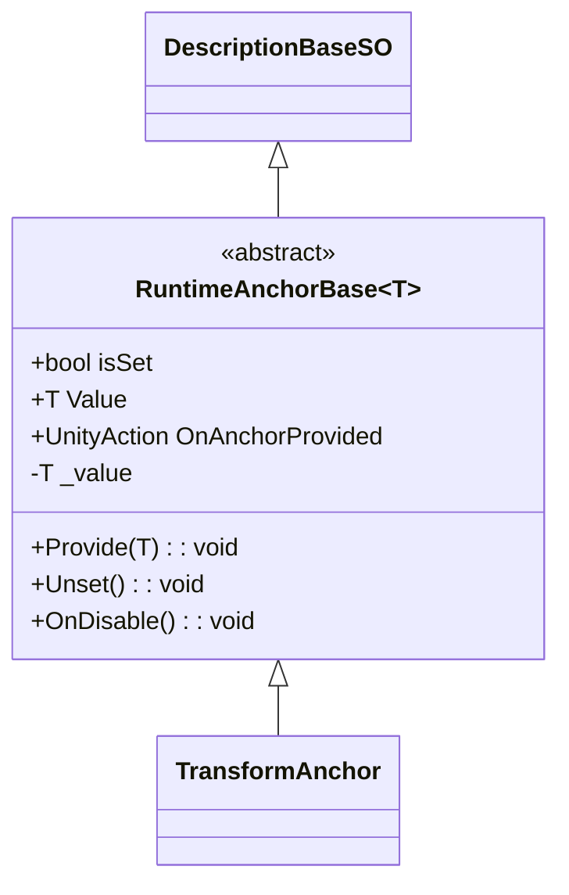
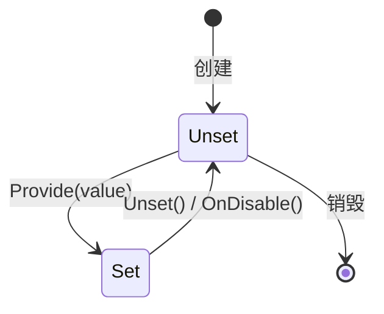

# RuntimeAnchors 模块解析

## 契约定义

### 核心类清单表

| 文件 | 角色 | 可见性 |
|------|------|--------|
| `RuntimeAnchorBase<T>` | 泛型锚点基类（Provide/Unset） | `public class` |
| `TransformAnchor` | Transform 专用锚点 | `public class` |
| `PathStorageSO` | 路径存储（非锚点，但同目录） | `public class` |

### 关键设计约束

1. **SO 存储运行时引用**：利用 ScriptableObject 的资产特性，在运行时存储跨场景引用
2. **空值守卫**：`Provide()` 检查 null，避免设置无效引用
3. **状态标志**：`isSet` 属性允许使用者检查锚点是否已设置
4. **OnDisable 清理**：防止悬空引用
5. **泛型约束**：`where T : UnityEngine.Object` 限制为 Unity 对象

### Mermaid classDiagram

---

## 生命周期与内存

### 动词语义表

| 操作 | 做什么 | 内存分配 |
|------|--------|----------|
| `Provide(T)` | 存储引用，设置 isSet=true，触发事件 | ❌ |
| `Unset()` | 清除引用，设置 isSet=false | ❌ |
| `OnDisable()` | 调用 Unset() | ❌ |

### 锚点状态流转

---

## 跨层桥接

### 使用场景

1. **玩家引用传递**：`SpawnSystem` 通过 `_playerTransformAnchor.Provide(player)` 存储玩家引用
2. **相机跟随**：`CameraManager` 监听 `_protagonistTransformAnchor.OnAnchorProvided` 设置跟随目标
3. **场景切换**：`PathStorageSO` 存储玩家选择的路径，用于下次场景加载时确定出生点

### 注入点

- `Provide(T)`：由生产者调用（如 SpawnSystem）
- `OnAnchorProvided`：由消费者监听（如 CameraManager）
- `isSet`：允许消费者检查是否已设置

---

## 落地难点

### 难点1：跨场景引用

**问题**：场景切换时，MonoBehaviour 引用会丢失。

**解决方案**：使用 SO 存储引用，SO 不随场景加载/卸载。

### 难点2：空值检查

**问题**：消费者可能在锚点未设置时访问 Value。

**解决方案**：`isSet` 属性 + `Provide()` 中的 null 检查。

---

## 坐标

- **模块优先级**：P0（底座，被 Camera、Characters 依赖）
- **依赖**：`DescriptionBaseSO`
- **被依赖**：Camera、Characters、Gameplay
