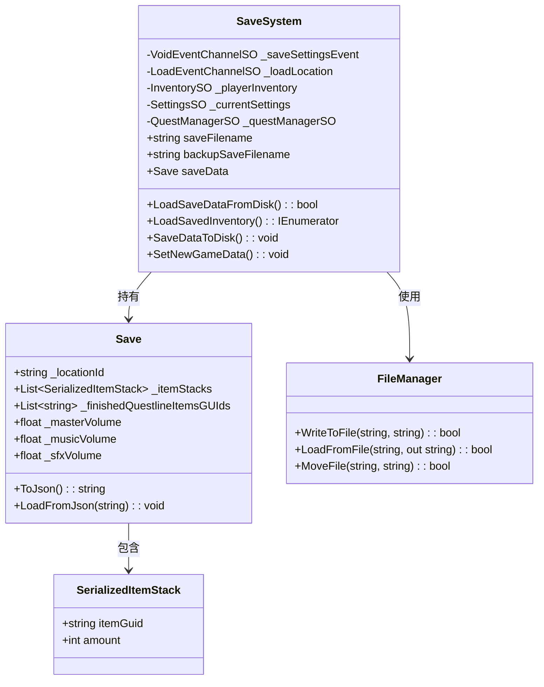
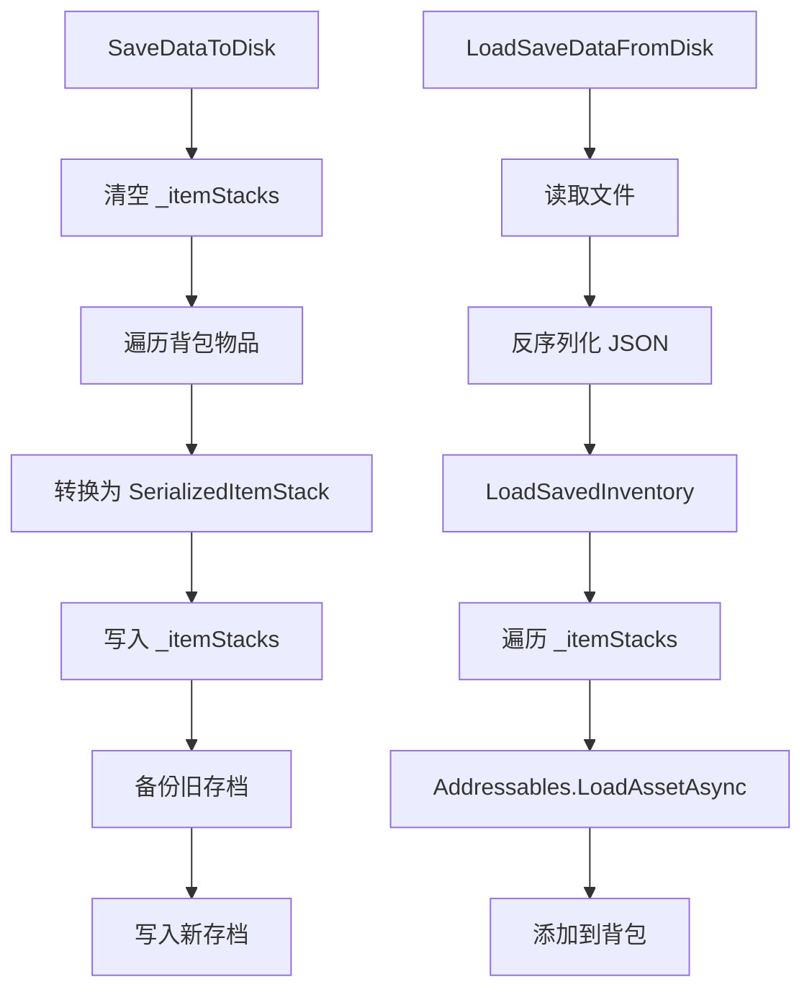

# SaveSystem 模块解析

## 契约定义

### 核心类清单表

| 文件 | 角色 | 可见性 |
|------|------|--------|
| `SaveSystem` | 存档管理器（加载/保存/设置） | `public class` |
| `Save` | 存档数据结构（JSON序列化） | `public class` |
| `FileManager` | 文件IO工具（静态类） | `public static class` |
| `SerializableScriptableObject` | 带Guid的SO基类 | `public class` |
| `SerializedItemStack` | 存档用的物品堆叠（Guid + 数量） | `public class` |

### 关键设计约束

1. **JSON序列化**：使用 `JsonUtility.ToJson()` / `FromJsonOverwrite()`
2. **Guid引用**：物品通过Guid存储，运行时通过Addressables加载
3. **备份机制**：保存前先备份旧存档（`MoveFile`）
4. **异步加载**：`LoadSavedInventory()` 使用协程异步加载物品
5. **持久化路径**：`Application.persistentDataPath`

### Mermaid classDiagram

---

## 生命周期与内存

### 动词语义表

| 操作 | 做什么 | 内存分配 |
|------|--------|----------|
| `LoadSaveDataFromDisk()` | 读取JSON，反序列化 | ✅ 字符串读取 |
| `LoadSavedInventory()` | 异步加载物品到背包 | ✅ 协程 + Addressables |
| `SaveDataToDisk()` | 序列化并写入文件 | ✅ JSON字符串 |
| `SetNewGameData()` | 清空存档，初始化新游戏 | ❌ |
| `FileManager.WriteToFile()` | 写入文件 | ❌ |
| `FileManager.MoveFile()` | 备份文件 | ❌ |

### 存档流程

---

## 跨层桥接

### 核心层与上层对接

1. **Inventory桥接**：`SaveSystem` 持有 `InventorySO` 引用，加载时填充数据
2. **Quest桥接**：保存/加载任务进度
3. **Settings桥接**：保存/加载音频/视频设置
4. **Location桥接**：加载场景时缓存目标位置

### 跨层 DTO 快照

- `Save`：完整的存档数据结构
- `SerializedItemStack`：Guid + 数量，用于JSON序列化

---

## 落地难点

### 难点1：Guid ↔ ItemSO 转换

**问题**：JSON不能直接序列化SO引用。

**解决方案**：保存时转换为Guid，加载时通过Addressables异步加载。

**仿写陷阱**：如果Guid不正确或资产被移动，加载会失败。

### 难点2：备份机制

**问题**：保存过程中崩溃可能导致存档损坏。

**解决方案**：先备份旧存档，再写入新存档。

**仿写陷阱**：如果备份失败，不应继续写入。

### 难点3：异步加载

**问题**：Addressables加载是异步的，需要等待完成。

**解决方案**：使用协程 `LoadSavedInventory()`。

**仿写陷阱**：如果未等待完成就继续，背包可能为空。

---

## 坐标

- **模块优先级**：P1（组合层，依赖 Inventory/Quests）
- **依赖**：Inventory、Quests、Events
- **被依赖**：SceneManagement、GameManager
