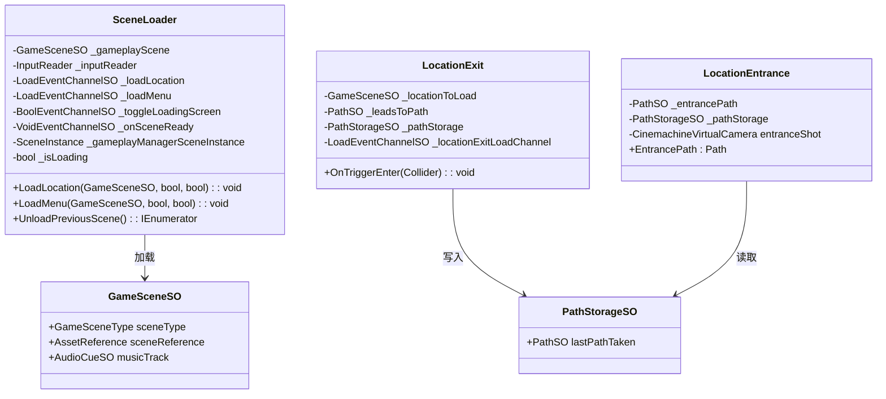
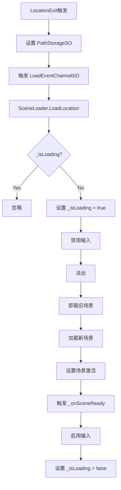

# SceneManagement 模块解析

## 契约定义

### 核心类清单表

| 文件 | 角色 | 可见性 |
|------|------|--------|
| `SceneLoader` | 场景加载器（Addressables + 协程） | `public class` |
| `InitializationLoader` | 初始化加载器（启动游戏） | `public class` |
| `StartGame` | 开始游戏（新游戏/继续） | `public class` |
| `LocationExit` | 场景出口（触发加载） | `public class` |
| `LocationEntrance` | 场景入口（出生点） | `public class` |
| `FallCatcher` | 掉落检测（重置位置） | `public class` |
| `GameSceneSO` | 场景配置 SO | `public class` |
| `PathSO` | 路径定义 SO | `public class` |
| `PathStorageSO` | 路径存储（运行时） | `public class` |

### 关键设计约束

1. **Addressables加载**：场景通过 `AssetReference` 异步加载
2. **持久化管理器**：`PersistentManagers` 场景包含所有管理器，不随场景卸载
3. **加载状态锁**：`_isLoading` 防止重复加载
4. **淡入淡出**：加载出，加载后淡入
5. **路径系统**：`PathSO` + `PathStorageSO` 记录玩家选择的路径

### Mermaid classDiagram

---

## 生命周期与内存

### 动词语义表

| 操作 | 做什么 | 内存分配 |
|------|--------|----------|
| `SceneLoader.LoadLocation()` | 加载新场景，卸载旧场景 | ✅ 场景资源 |
| `LocationExit.OnTriggerEnter()` | 设置路径，触发加载 | ❌ |
| `LocationEntrance.Awake()` | 检查是否是目标入口，设置相机 | ❌ |
| `InitializationLoader.Start()` | 加载管理器场景，加载主菜单 | ✅ |

### 场景加载流程

---

## 跨层桥接

### 核心层与上层对接

1. **事件桥接**：`LoadEventChannelSO` 触发加载，`VoidEventChannelSO` 通知场景就绪
2. **路径桥接**：`PathStorageSO` 传递路径信息给 `SpawnSystem`
3. **相机桥接**：`LocationEntrance` 控制入口相机优先级

---

## 落地难点

### 难点1：加载状态锁

**问题**：玩家可能同时触发两个出口。

**解决方案**：`_isLoading` 标志防止重复加载。

### 难点2：持久化管理器场景

**问题**：管理器需要在所有场景中存活。

**解决方案**：`PersistentManagers` 场景在启动时加载，切换位置时不卸载。

### 难点3：入口相机切换

**问题**：需要从入口相机平滑过渡到游戏相机。

**解决方案**：`LocationEntrance` 在 `OnSceneReady` 后延迟降低入口相机优先级。

---

## 坐标

- **模块优先级**：P1（组合层，依赖 Events/RuntimeAnchors）
- **依赖**：Events、RuntimeAnchors
- **被依赖**：Gameplay、SaveSystem
