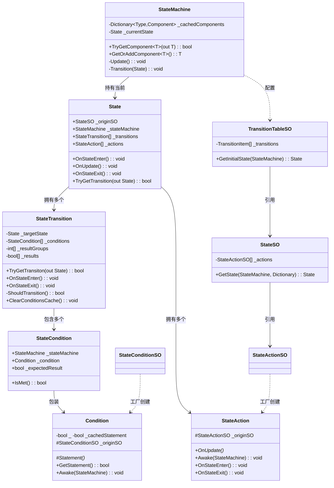
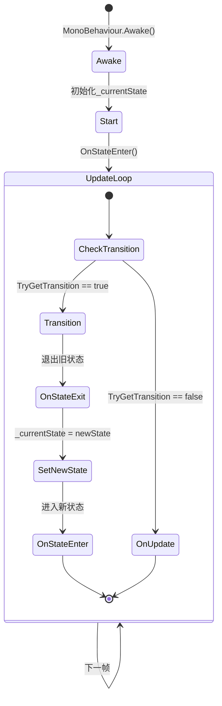
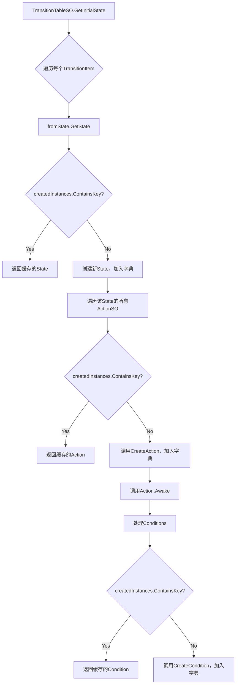

# StateMachine 模块解析

## 契约定义

### 核心接口/类清单表

| 文件 | 角色 | 可见性 |
|------|------|--------|
| `IStateComponent` | 状态组件契约（Enter/Exit） | `internal` interface |
| `State` | 运行时状态（持有transitions + actions） | `public class` |
| `StateMachine` | MonoBehaviour宿主（Update驱动） | `public class` |
| `StateTransition` | 转换条件封装（IStateComponent） | `public class` |
| `StateAction` | 动作抽象基类（OnUpdate抽象） | `public abstract class` |
| `Condition` | 条件抽象基类（Statement + 缓存） | `public abstract class` |
| `StateCondition` | 结构体：Condition + 期望值 | `public readonly struct` |
| `TransitionTableSO` | 配置入口（ScriptableObject） | `public class` |
| `StateSO` | 状态配置（持有actions数组） | `public class` |
| `StateActionSO` | 动作SO工厂（CreateAction抽象） | `public abstract class` |
| `StateConditionSO` | 条件SO工厂（CreateCondition抽象） | `public abstract class` |

### 关键设计约束

1. **SO配置 → 运行时实例的1:1映射**：每个 `StateActionSO` / `StateConditionSO` 在 `TransitionTableSO.GetInitialState()` 中通过 `Dictionary<ScriptableObject, object>` 保证只实例化一次，避免重复创建。
2. **条件缓存机制**：`Condition.GetStatement()` 在同一帧内只计算一次，`_isCached` 标志在 `StateTransition.ClearConditionsCache()` 中统一清除。
3. **状态机生命周期绑定 MonoBehaviour**：`Awake` 初始化状态，`Start` 触发首次 `OnStateEnter`，`Update` 驱动 `TryGetTransition` + `OnUpdate`。
4. **组件缓存优化**：`StateMachine.TryGetComponent<T>()` 使用 `Dictionary<Type, Component>` 缓存，避免重复调用 Unity 的 `TryGetComponent`。
5. **Editor 重载安全**：`OnAfterAssemblyReload` 重新初始化状态机，防止编辑器播放模式切换后状态丢失。

### Mermaid classDiagram

---

## 生命周期与内存

### 动词语义表

| 操作 | 做什么 | 内存分配 |
|------|--------|----------|
| `TransitionTableSO.GetInitialState()` | 遍历所有TransitionItem，实例化State/Transition/Action/Condition | ✅ 分配Dictionary + 所有运行时实例 |
| `StateActionSO.GetAction()` | 从缓存取或创建新实例，调用Awake | ✅ 首次创建时分配 |
| `StateConditionSO.GetCondition()` | 从缓存取或创建Condition实例 | ✅ 首次创建时分配 |
| `Condition.GetStatement()` | 缓存模式下只调用一次Statement() | ❌ 无分配（bool字段） |
| `StateTransition.TryGetTransiton()` | 按resultGroups计算AND/OR逻辑 | ❌ 复用_results数组 |
| `StateMachine.Update()` | 检查转换 + 执行当前状态OnUpdate | ❌ 无分配 |
| `StateMachine.TryGetComponent()` | 字典缓存查找 | ❌ 无分配 |

### 状态机流转图

### 对象分配/复用流程

---

## 跨层桥接

### 核心层与上层对接

1. **SO配置层**：`TransitionTableSO` / `StateSO` / `StateActionSO` / `StateConditionSO` 都是 `ScriptableObject`，在 Inspector 中可视化配置。
2. **运行时层**：`State` / `StateAction` / `Condition` 是运行时实例，通过 `createdInstances` 字典保证 SO → 实例的 1:1 映射。
3. **注入点**：
   - `StateAction.Awake(StateMachine)`：在此处缓存需要的组件引用
   - `Condition.Awake(StateMachine)`：同上
   - `StateAction.OnUpdate()` / `OnStateEnter()` / `OnStateExit()`：业务逻辑入口

### 跨层 DTO 快照

- `StateActionSO` 作为共享数据容器（如 `ChasingTargetActionSO` 持有 `TransformAnchor` 和 `chasingSpeed`）
- `StateConditionSO` 作为条件参数容器（如 `IsInSpecificGameStateSO` 持有 `gameStateToCheck`）
- 运行时通过 `OriginSO` 属性访问配置数据

---

## 落地难点

### 难点1：SO-实例1:1映射的正确实现

**问题**：同一个 `StateActionSO` 可能被多个 `State` 引用，必须保证只创建一个运行时实例。

**解决方案**：使用 `Dictionary<ScriptableObject, object>` 作为传递上下文，在 `GetState()` / `GetAction()` / `GetCondition()` 中统一检查。

**仿写陷阱**：如果忘记传递同一个字典，会导致同一 SO 创建多个实例，破坏状态一致性。

### 难点2：条件缓存与清除的时机

**问题**：条件在同一帧内可能被多个 Transition 复用，需要缓存结果；但下一帧必须重新计算。

**解决方案**：
- `Condition._isCached` 标志在 `GetStatement()` 中设置
- `StateTransition.ClearConditionsCache()` 在 `TryGetTransition()` 返回后统一清除

**仿写陷阱**：如果清除时机错误（如在 `ShouldTransition()` 内清除），会导致同帧后续 Transition 重复计算。

### 难点3：resultGroups 的 AND/OR 分组逻辑

**问题**：条件列表需要支持 `A AND B OR C AND D` 这样的复合逻辑。

**解决方案**：
- `ConditionUsage.Operator` 枚举（And/Or）
- `ProcessConditionUsages()` 将连续的 And 条件分组到同一个 `resultGroups[i]`
- `ShouldTransition()` 内按组计算 AND，组间计算 OR

**仿写陷阱**：分组算法中的索引管理容易出错，特别是 `i++` 在内外层循环中的交互。

---

## 坐标

- **模块优先级**：P0（底座，被所有AI和Gameplay依赖）
- **依赖**：无外部依赖（纯框架）
- **被依赖**：Characters、Gameplay（间接）、Audio（间接）
