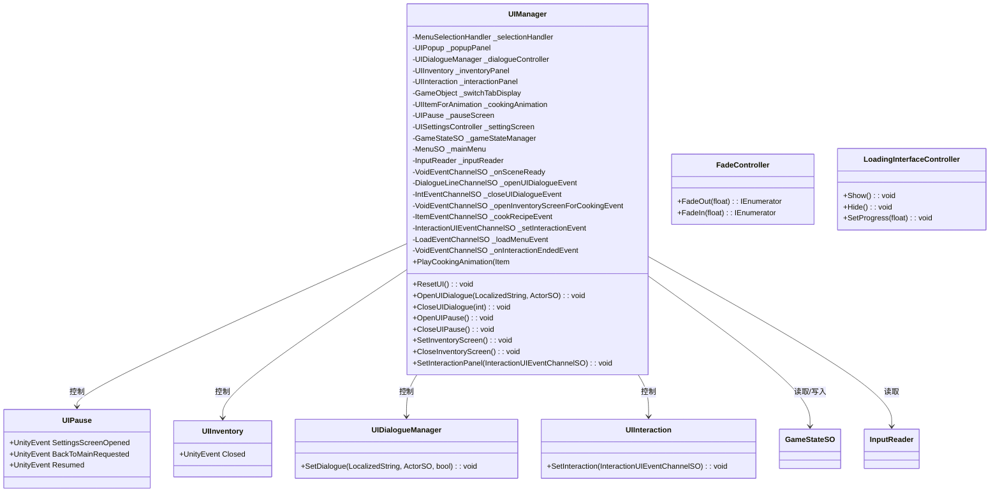
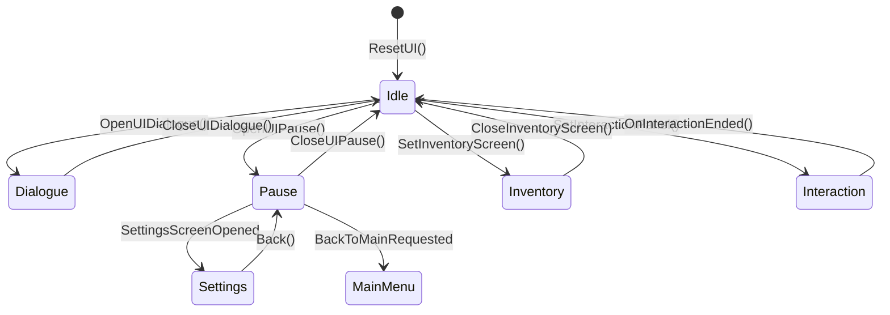

# UI 模块解析

## 契约定义

### 核心类清单表

| 文件 | 角色 | 可见性 |
|------|------|--------|
| `UIManager` | UI总管理器（协调各面板） | `public class` |
| `UIPause` | 暂停菜单 | `public class` |
| `UIPopup` | 弹窗 | `public class` |
| `UIInventory` | 背包面板 | `public class` |
| `UIInteraction` | 交互提示面板 | `public class` |
| `UIDialogueManager` | 对话UI控制器 | `public class` |
| `UISettingsController` | 设置面板 | `public class` |
| `UIHealthBarManager` | 血条管理 | `public class` |
| `UIMenuManager` | 菜单管理 | `public class` |
| `UIMainMenu` | 主菜单 | `public class` |
| `UIGenericButton` | 通用按钮 | `public class` |
| `UIButtonPrompt` | 按钮提示 | `public class` |
| `FadeController` | 淡入淡出控制 | `public class` |
| `LoadingInterfaceController` | 加载界面 | `public class` |

### 关键设计约束

1. **事件驱动**：`UIManager` 监听多个事件通道，控制各面板显示/隐藏
2. **状态同步**：暂停菜单与 `GameStateSO` 同步（`Pause` 状态）
3. **输入模式切换**：打开菜单时切换输入模式（`EnableMenuInput`）
4. **时间缩放**：暂停时设置 `Time.timeScale = 0`
5. **场景重置**：`OnSceneReady` 时重置所有面板

### Mermaid classDiagram

---

## 生命周期与内存

### 动词语义表

| 操作 | 做什么 | 内存分配 |
|------|--------|----------|
| `UIManager.OnEnable()` | 订阅所有事件 | ❌ |
| `UIManager.OnDisable()` | 取消所有订阅 | ❌ |
| `ResetUI()` | 禁用所有面板，恢复时间 | ❌ |
| `OpenUIPause()` | 显示暂停菜单，暂停时间 | ❌ |
| `CloseUIPause()` | 隐藏暂停菜单，恢复时间 | ❌ |
| `OpenUIDialogue()` | 显示对话UI | ❌ |
| `CloseUIDialogue()` | 隐藏对话UI | ❌ |

### UI状态流转

---

## 跨层桥接

### 核心层与上层对接

1. **事件桥接**：监听 `DialogueLineChannelSO`、`IntEventChannelSO`、`InteractionUIEventChannelSO` 等
2. **状态桥接**：与 `GameStateSO` 同步（暂停/恢复）
3. **输入桥接**：通过 `InputReader` 切换输入模式

---

## 落地难点

### 难点1：事件订阅管理

**问题**：`UIManager` 订阅大量事件，容易遗漏取消订阅。

**解决方案**：严格在 `OnEnable` 订阅、`OnDisable` 取消订阅，成对出现。

### 难点2：暂停时间控制

**问题**：暂停时需要冻结游戏，但UI动画仍需播放。

**解决方案**：使用 `Time.timeScale = 0`，UI动画使用 `UnscaledDeltaTime`。

### 难点3：面板层级管理

**问题**：多个面板可能同时打开（如暂停时打开背包）。

**解决方案**：使用状态机或栈管理面板层级。

---

## 坐标

- **模块优先级**：P2（业务层，依赖 Events/Input/Gameplay）
- **依赖**：Events、Input、Gameplay
- **被依赖**：无（顶层）
